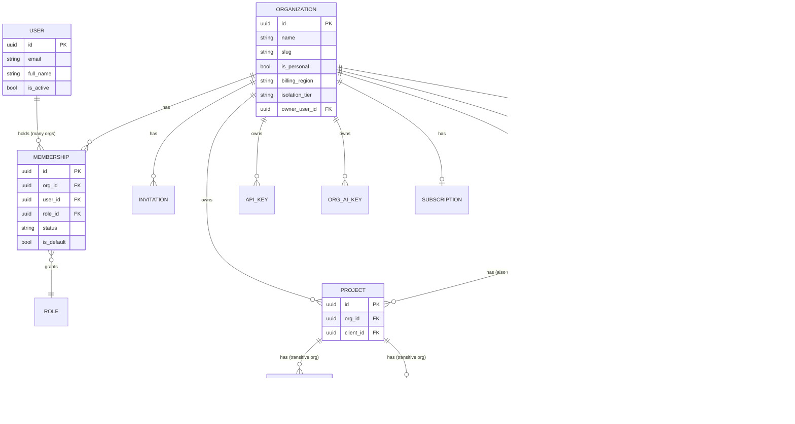

# Organization-First Architecture

**Status:** Design only. No code changed.
**Scope:** the permanent ownership model for Voxly — every account, every persona (solo
freelancer through enterprise), one architecture.

## 0. This document's relationship to what already exists

Before writing a line of this, three existing documents were read in full because writing a
competing or contradictory one would be a real failure, not a stylistic choice:

- **`docs/TARGET_ARCHITECTURE.md`** — the standing 12-month, 9-phase target architecture
  (gateway, events, workers, search, storage, RBAC, billing, observability, deployment). It
  already establishes the core call this document is being asked to make ("the tenant boundary
  must move from `User` to `Organization`. This is the single most important change and
  everything else depends on it" — its own §0.2) and already contains a correct, detailed ER
  diagram, RBAC model, invitation model, billing model, and a 9-phase roadmap. **This document
  does not replace it.** It is the detailed, current-state-grounded specification for exactly one
  step of that roadmap — its own **Phase 2: "Tenant access layer + RLS."**
- **`docs/PHASE1_ROLLOUT_PLAN.md`** — the operational plan that shipped `TARGET_ARCHITECTURE.md`'s
  Phase 1 (Milestones 1–3: org schema, backfill, dual-write). Its final line says: *"Only after
  all of the above: revisit `docs/TARGET_ARCHITECTURE.md`'s Phase 2 design... to scope what
  Milestone 4 concretely is."* **This document is Milestone 4.** Verified against production
  today (see §1.3): every one of Milestone 4's data-quality preconditions is met, with one
  honest exception — its "no user-visible incidents attributable to this rollout" criterion was
  violated by the P0-1 account-deletion bug, which is direct, lived proof of the exact risk this
  whole migration exists to eliminate (§23.1).
- **`PHASE2_IMPLEMENTATION_PLAN.md`** (root) — an **unrelated, already-completed** "Phase 2"
  (Clients/Projects/Milestones/Channels feature work — CRUD, GitHub-stats exposure, the Channels
  endpoint). This is a genuine naming collision worth fixing: from here on, this migration is
  called **Milestone 4**, never "Phase 2," to avoid confusion with that document. Its findings are
  reused directly below (e.g., the already-made decision that `milestones` needs no `org_id`
  column because it's scoped transitively — §4, §14).

This document adds what none of the three above have: the exact current production state
(verified minutes before writing this, not assumed), the lessons of a real incident this
architecture would have prevented, and direct answers to all 25 questions asked, in one place.

---

## Executive summary and recommendation

**Commit fully to organization-first ownership: every account — including a solo freelancer —
belongs to exactly one auto-created personal Organization at minimum, and every business entity
is owned by an Organization, never a User, with no code path that special-cases the solo case.**
This was already the direction `TARGET_ARCHITECTURE.md` set and this session's own P0-1 fix
already committed to (its own §4: *"do not roll the flag back... production already contains
organization data"*). Nothing found while writing this document changes that call — if anything,
today's data (§1.3) and the P0-1 incident (§23.1) make it stronger.

What this document adds to that prior commitment, as explicit, sometimes-different-from-what-was-
asked recommendations (per the instruction to challenge where appropriate):

1. **Support multi-organization membership per user from day one** (§5, §8) — the persona list
   (freelancer, consultant, agency, enterprise) requires it; a consultant working across client
   orgs cannot be modeled as one user = one org.
2. **Don't put `org_id` on every table.** Denormalize it onto entities that are directly,
   independently queried at the org level (`Client`, `Project`, `APIKey`, `Subscription`,
   `UsageLog`); derive it transitively for pure child rows that are always reached through a
   parent (`Milestone`, `ConversationState`, `GitHubCache`) — this is not a new idea, it's the
   team's own already-shipped decision for `milestones` (§4, §14), extended consistently rather
   than mechanically applying one rule everywhere.
3. **Don't invalidate the JWT model to add a workspace switcher.** Resolve the active org
   per-request, not by baking `org_id` into the token (§8) — baking it in would force a re-login
   on every workspace switch.
4. **Adopt Postgres Row-Level Security as defense-in-depth**, not just an app-layer filter swap
   (§23) — `TARGET_ARCHITECTURE.md` already recommends this; it's restated here with a concrete
   reason drawn from this codebase's own history: this exact class of bug (forgetting a scoping
   filter) has already happened multiple times (global phone lookup, GitHub webhook "first random
   user," and is the structural root of P0-1) and app-layer discipline alone has not been
   sufficient to prevent it.
5. **Keep `user_id` after the migration, renamed to an audit column (`created_by_user_id`,
   `ON DELETE SET NULL`), rather than dropping it** (§15, §4) — P0-1 happened *because* the
   system briefly had two unreconciled ownership models; the fix for that is not to erase all
   trace of the old one, it's to make the new one authoritative and keep the old one as history.
6. **Treat "AI Agents," "Knowledge Base," and "Automations" as out of scope for this milestone**
   (§13) — verified against the current codebase: none of these exist as persisted, ownable
   entities today (§1.1). This milestone defines the ownership *contract* they must follow when
   built, not a migration for data that doesn't exist.

---

## 1. Current architecture

### 1.1 What exists today, verified against the live codebase and production database (not assumed)

**Real, persisted, tenant-relevant entities:**

| Entity | Table | Owner column(s) today |
|---|---|---|
| User | `users` | — (is the tenant, today) |
| Organization | `organizations` | `owner_user_id` (`users.id`, RESTRICT) |
| Membership | `memberships` | `org_id` + `user_id` |
| Role | `roles` | `org_id` (nullable — 5 system roles seeded, `org_id IS NULL`) |
| Invitation | `invitations` | `org_id`, fully modeled (token, expiry, status lifecycle) — **zero API surface**, no endpoint has ever been registered for it |
| Client | `clients` | `user_id` (NOT NULL, CASCADE) + `org_id` (nullable, RESTRICT) |
| Project | `projects` | `client_id` (NOT NULL, CASCADE) + `org_id` (nullable, RESTRICT) — no direct `user_id` |
| Milestone | `milestones` | `project_id` only — **no `org_id` column, by deliberate existing decision** (`PHASE2_IMPLEMENTATION_PLAN.md` §0: scoped transitively, no migration needed) |
| ChatHistory | `chat_history` | `client_id` (CASCADE) + `project_id` (SET NULL) — no `org_id` |
| ConversationState | `conversation_states` | `client_id` (CASCADE, unique — one row per client) — no `org_id` |
| GitHubCache | `github_cache` | `project_id` (CASCADE, unique) — no `org_id` |
| APIKey | `api_keys` | `user_id` (NOT NULL, CASCADE) + `org_id` (nullable, RESTRICT) |
| UserAIKey (BYOK) | `user_ai_keys` | `user_id` (NOT NULL, CASCADE) + `org_id` (nullable, RESTRICT) |
| Subscription | `subscriptions` | `user_id` (NOT NULL, CASCADE) + `org_id` (nullable, RESTRICT) + `plan_id` |
| UsageLog | `usage_logs` | `user_id` (NOT NULL, CASCADE) + `org_id` (nullable, RESTRICT) + `api_key_id` (nullable, CASCADE) |
| Plan | `plans` | — global reference data, not tenant-owned |

**Entities the stated architecture principles name that do not exist in the backend at all**,
verified by grepping every model file and every router (not inferred):

| Named in scope | Backend reality |
|---|---|
| "AI Agents" | `VoxlyAgent` (`services/ai_agent.py`) is a stateless class instantiated fresh per request; its system prompt is built inline in Python (`api/v1/ai.py`). **No table, no persisted configuration, no per-org customization, exactly one behavior for the whole platform.** The frontend's `app/agents/page.tsx` is explicitly `PreviewBanner`-marked mock UI from this engagement's own earlier work. |
| "Knowledge Base" | `tools/kb_tools.py` exists as an AI tool-calling stub; **no model, no table, no data**. |
| "Automations" | **No model, no table, no route.** `app/automations/page.tsx` is `PreviewBanner`-marked mock UI. |
| "Channels" | **Not an owned entity.** `GET /api/v1/channels` (real, shipped) is a read-only aggregate `GROUP BY client_id, channel` over `chat_history` — there is nothing to migrate ownership *of*, because it isn't stored anywhere independently. |

This matters concretely for scope: this milestone defines ownership contracts for entities that
exist, and a contract-for-when-built for entities that don't. It does not build the entities that
don't exist yet — that's separate, unscoped product work, and conflating the two would make this
migration's blast radius impossible to reason about.

### 1.2 The current ownership model, precisely

**Phase 0 (the original design):** flat — `User` is the tenant. Every business entity has a
`user_id` (or reaches one transitively) as its sole real ownership signal. This is still true
for every *read* path today: every list/get/update/delete query in `clients.py`, `projects.py`,
`milestones.py`, `billing.py`, `api_keys.py`, `ai_keys.py`, `dashboard.py` filters on `user_id`
(directly, or via a `user_client_ids` subquery) — verified by reading every one of them, not
assumed.

**Phase 1 (already shipped, Milestones 1–3):** `Organization`/`Membership`/`Role`/`Invitation`
schema exists. `DUAL_WRITE_ORGANIZATIONS_ENABLED=true` in production: every registration and
every write to `Client`/`Project`/`APIKey`/`UserAIKey`/`Subscription`/`UsageLog` also
self-heals a personal `Organization` + owner `Membership` and stamps `org_id` — **but zero read
paths consult `org_id`.** `org_id` is written everywhere it's modeled and read nowhere. This is
the split-brain state, and it is the direct root cause of the P0-1 account-deletion bug fixed
earlier this session: the deletion code was written for the Phase-0 model and nobody updated it
when Phase 1 started creating real, referentially-enforced `Organization` rows underneath it.

**RBAC today:** data model only. `Role`/`Membership.role_id` exist and are populated (every
membership gets the seeded `owner` role), but **no endpoint anywhere checks a permission.**
Authorization today is binary: authenticated or not, plus an unrelated `super_admin` router.

**Invitations today:** the table can represent a pending invite correctly (unique per
`(org_id, email)`, token, expiry, status lifecycle) but **no route creates, accepts, or lists
one.** Every organization in production today therefore has exactly one member — its owner.

### 1.3 Current production state, verified minutes before writing this document

```
clients.org_id IS NULL:        0
subscriptions.org_id IS NULL:  0
api_keys.org_id IS NULL:       0
usage_logs.org_id IS NULL:     0
user_ai_keys.org_id IS NULL:   0
projects.org_id IS NULL:       0
users without an owned org:    0
orgs missing an owner membership: 0
total users / orgs / memberships: 16 / 16 / 16
```

Every data-quality precondition `PHASE1_ROLLOUT_PLAN.md` §8 sets for scoping Milestone 4 is met
**except one, honestly**: *"No user-visible incidents... attributable to this rollout"* — P0-1
was exactly that. And *"sustained period... with no rollback"* was technically broken today, for
about 15 minutes, when this session's own deploy accidentally reset
`DUAL_WRITE_ORGANIZATIONS_ENABLED` to `false` via `--env-vars-file` full-replace semantics
(caught and fixed same-session — see `STABILIZATION_REPORT.md` §3). Both incidents point at the
same underlying fact: **the current model is held together by application-code discipline and an
out-of-band environment variable, not by anything the database or the type system enforces.**
That is precisely the gap Milestone 4 closes.

---

## 2. Target architecture

**Every account belongs to an Organization. Users are global identities that hold Memberships;
they own nothing directly.** Concretely:

- `User` retains only identity/credential concerns: email, password hash, OAuth IDs, name. It
  stops being a foreign key target for any business table.
- **Every business entity's real, enforced owner is `org_id`.** Not optional, not dual-written —
  `NOT NULL`, indexed, and the *only* column any query filters tenancy by.
- **A user can belong to more than one Organization** (§5, §8) — required by the persona list
  itself (a consultant working across multiple client organizations cannot be represented by
  today's implicit one-user-one-org assumption).
- **The "personal workspace" is not a special case.** It is an `Organization` like any other,
  created automatically at registration, with the registering user as its sole `owner` member. No
  code path anywhere asks "is this a personal account or a team account?" — it asks "what
  permission does this membership grant in this org?", which is the same question for a
  freelancer with one member and an agency with fifty.
- **RBAC is enforced, not just modeled** — a single `require(permission)` dependency, not
  per-endpoint hand-written checks.
- **Isolation is enforced at two layers**, not one: a tenant-scoped access layer in the app (so a
  developer physically cannot obtain an unscoped session), *and* Postgres Row-Level Security as a
  backstop (so a bug in the app layer still cannot cross a tenant boundary). This directly answers
  `TARGET_ARCHITECTURE.md`'s own stated verdict: *"isolation depends on every developer
  remembering `.filter(user_id == current_user.id)`. That is a data-leak waiting to happen."*

---

## 3. ER diagram

Target-state ownership graph. Solid `org_id` edges are direct/denormalized (§14 explains which
tables get this and why); dashed edges are transitive (derived by joining through a parent, no
`org_id` column on that table).



---

## 4. Entity ownership

The single most load-bearing table in this document — every other section refers back to it.

| Entity | Owner today | Owner in target | `org_id` placement | Migration needed |
|---|---|---|---|---|
| Client | `user_id` (real) + `org_id` (dual-write, unused) | Organization | Direct, `NOT NULL` | Yes — cutover reads, drop `NOT NULL`-block, rename `user_id`→`created_by_user_id` |
| Project | via Client | Organization | Direct, `NOT NULL` (already has the column) | Yes — same as Client |
| Milestone | via Project | Organization | **Transitive — no column** (existing decision, kept) | No schema change |
| ChatHistory | via Client | Organization | **Transitive by default; see §14 for the one condition that would add a direct column** | No schema change (default) |
| ConversationState | via Client | Organization | Transitive | No schema change |
| GitHubCache | via Project | Organization | Transitive | No schema change |
| APIKey | `user_id` (real) + `org_id` (unused) | Organization, with `created_by_user_id` audit | Direct, `NOT NULL` | Yes |
| UserAIKey → **OrgAIKey** | `user_id` (real) + `org_id` (unused) | Organization | Direct, `NOT NULL` | Yes, plus rename (§13) |
| Subscription | `user_id` (real) + `org_id` (unused) | Organization | Direct, `NOT NULL` | Yes (§11) |
| UsageLog | `user_id` (real) + `org_id` (unused) | Organization | Direct, `NOT NULL` | Yes |
| Role | already `org_id`-scoped (nullable for system roles) | unchanged | — | No |
| Membership | already correct | unchanged | — | No |
| Invitation | already correct | unchanged | — | No (needs an API surface, not a schema change) |
| AI Agent config (future) | N/A — doesn't exist | Organization, from creation | Direct, `NOT NULL` | N/A — build it correctly, no migration |
| Knowledge Base (future) | N/A | Organization | Direct, `NOT NULL` | N/A |
| Automations (future) | N/A | Organization | Direct, `NOT NULL` | N/A |

---

## 5. Membership model

Keep `Membership(org_id, user_id, role_id, status)` — it's already correctly shaped. Two
additions:

1. **Support many memberships per user** (already structurally true — no unique constraint on
   `user_id` alone). This must be an explicit product decision, not an accident: a consultant
   joining three client orgs, or a freelancer with a personal workspace who also joins a client's
   team, both need this. Nothing about "organization-first" implies "one org per user" — the
   *account* is org-first; the *person* can hold several accounts' worth of membership.
2. **Add `is_default: bool`** — which org loads first after login / which org a bare
   (no-org-context) API request resolves to during the transition window (§16). Exactly one
   `is_default=true` membership per user, enforced by a partial unique index
   (`WHERE is_default`), same technique already used for `roles`' partial unique indexes.

`status` stays `invited | active | suspended`; add `removed` is unnecessary — removing a member
is a row delete (Membership has no children of its own to orphan), and Invitation already covers
the "not yet a member" state distinctly.

---

## 6. RBAC model

Reuse `TARGET_ARCHITECTURE.md` §5's model exactly — it's already correct and doesn't need
rediscovering: system roles (`owner`, `admin`, `member`, `billing`, `viewer`) with a flat
`resource:action` permission catalog (`client:write`, `billing:manage`, `member:invite`, …),
custom per-org roles supported by the schema already (`roles.org_id`, `is_system`).

What this milestone adds that the target doc left as a later step: **enforcement is in scope
here, not deferred again.** A single `require_permission(perm: str)` FastAPI dependency, resolved
from the active `TenantContext` (already-built-and-tested `get_tenant_context`, extended), is the
*only* authorization primitive going forward — replacing every hand-written `.filter(user_id ==
current_user.id)` ownership check. `super_admin` becomes a platform-level flag orthogonal to org
roles (unchanged from `TARGET_ARCHITECTURE.md` §5's recommendation).

**Solo-workspace consequence:** a freelancer's personal org has exactly one membership, role
`owner`. Every permission check still runs — it just always passes for that one member. This is
the concrete meaning of "no special code path for freelancers": the enforcement code is identical
for one member and fifty; only the data differs.

---

## 7. Invitation flow

The `Invitation` model is already fully shaped (verified in full, `models/invitation.py`) — a
pending invite for an email, keyed `(org_id, email)` uniquely, token + `expires_at`, status
`pending | accepted | revoked | expired`, re-invite updates the existing row rather than
duplicating. **What's missing is entirely the API surface**, not the data model:

1. `POST /api/v1/organizations/{org_id}/invitations` — owner/admin only, creates or refreshes an
   invitation, sends an email (reusing `email_service.py`, and closing the same long-standing
   "password reset is console-only" gap by finally productionizing transactional email in the
   same pass).
2. `GET /api/v1/invitations/{token}` — public, token-gated preview (org name, inviter, role) for
   the accept-invite screen, works whether or not the invitee has an account yet.
3. `POST /api/v1/invitations/{token}/accept` — if the invitee has no account, this doubles as
   registration; if they do, it creates the `Membership` (role from the invitation), marks the
   invitation `accepted`, and — this is the one new behavior — **does not touch their existing
   personal workspace.** Accepting a team invite is additive, never a replacement.
4. `POST /api/v1/invitations/{token}/decline` and `DELETE .../invitations/{id}` (revoke, by an
   admin) for completeness.

Seat counting (`TARGET_ARCHITECTURE.md` §4/§19: active memberships against a plan's seat limit)
is a billing-module concern layered on top of this, not part of the invitation flow itself.

---

## 8. Workspace switcher

**Recommendation: resolve the active organization per request, never bake `org_id` into the
JWT.** Reasoning: a JWT is long-lived (`ACCESS_TOKEN_EXPIRE_MINUTES=1440`, 24h, per current
config) and stateless by design — if the active org were a token claim, switching workspaces
would require discarding and re-issuing the token, which either means a forced re-login (bad UX)
or a silent token-refresh dance that reintroduces state the JWT was chosen to avoid. Instead:

- Frontend sends the current workspace as an explicit `X-Org-Id` header (or a route-embedded org
  slug — either works; header is simpler and matches how `Authorization` already works) alongside
  the JWT on every request.
- The `get_tenant_context` dependency (already built, already tested, already the thing every
  create-endpoint calls) is extended to: validate the caller has an `active` `Membership` in the
  requested `org_id`; if no header is sent, fall back to that user's `is_default` Membership
  (§5) — this is what makes the transition backward-compatible (§16) for every existing client
  that doesn't know this header exists yet.
- **Frontend UI**: a workspace switcher (org name + avatar, dropdown of the user's other orgs,
  "Create organization" action) in the same header region as the existing user menu; selecting an
  org updates the stored `X-Org-Id` and refetches — no page reload, no token change, no logout.

This is additive and non-breaking by construction: today's single-membership-per-user reality
means the fallback path *is* the only path until multi-org membership is actually used.

---

## 9. Personal workspace behavior

Not a special mode — an `Organization` row like any other, with two conventions:

- **`is_personal: bool`**, set once at creation, never changed. Recommended as an explicit
  discriminator rather than inferring "personal" from membership count (`count == 1`), because
  membership count is also `1` for a real team mid-invitation, or a team that happens to have
  lost members — those must not silently start behaving like personal workspaces.
- **Never auto-deleted, never auto-merged.** If a freelancer joins an agency's org via invitation,
  their personal workspace persists untouched — accepting an invite is additive (§7). A user can
  have a personal workspace *and* several team memberships simultaneously; the workspace switcher
  (§8) is exactly how they move between them.
- **Billing is independent per org** (§11) — a freelancer's personal workspace carries its own
  `Subscription`; joining a paid team org doesn't change what their personal workspace costs.

This directly reuses machinery already built and tested this session: the P0-1 account-deletion
fix's 409-guard ("reject deletion if the org has another member") already treats a personal
workspace's deletion as the simple, fully-implemented case, and defers the harder "org has other
members" case to ownership transfer (§10) — exactly the boundary this section describes.

---

## 10. Organization lifecycle

- **Creation:** automatic at registration (personal, `is_personal=true`), or explicit
  `POST /api/v1/organizations` (a user starting a *second*, team-oriented org — e.g., an
  established freelancer forming an agency later, without abandoning their personal workspace).
- **Renaming / slug / billing-region changes:** owner/admin only, straightforward `PATCH`, no new
  design needed.
- **Ownership transfer:** **does not exist today and must be built as part of this milestone** —
  it's the direct, deferred dependency the P0-1 design doc flagged (`ACCOUNT_DELETION_DESIGN.md`
  §9): the account-deletion 409 guard currently has no resolution path once it's reachable (it
  isn't yet, because no org has more than one member in production today). `PATCH
  /api/v1/organizations/{id}/owner` (current owner or platform admin only) reassigns
  `owner_user_id` to another active member with the `owner` role granted, single transaction.
- **Deletion:** the sole-owner case is already fully solved (P0-1's transactional hard delete). A
  multi-member org's deletion needs an explicit decision, not silently reused logic: recommend
  **requiring ownership transfer or member removal down to solo first** (i.e., org deletion is
  always the "solo owner deletes their account" path, never a direct "nuke a 50-person org" API)
  — this avoids ever building a code path that can destroy other people's data as a side effect of
  one person's action, which is exactly the failure mode `ACCOUNT_DELETION_DESIGN.md` §6 (a) ruled
  out for the same reason.

---

## 11. Billing ownership

`Subscription` moves from `user_id` to `org_id` as its real key — `Organization` is already
documented in its own model docstring as *"the tenant and billing unit."* Concretely:

- Every Organization — personal or team — carries exactly one `Subscription`. A freelancer's
  personal workspace is billed the same way a team org is; there is no separate "individual
  billing" code path.
- `Plan` gains seat limits (`TARGET_ARCHITECTURE.md` §19) alongside its existing
  `max_clients`/`max_projects`/`rate_limit_*` fields — seats are counted as `active` Memberships
  against the org's plan.
- `payment_gateway`/`gateway_customer_id`/`gateway_subscription_id` stay exactly as shaped today,
  just re-keyed to `org_id`; the existing India/international Stripe-vs-Razorpay region split is
  unaffected — it moves with the org, not the user.
- `UsageLog` becomes the org-level metering feed (already has `org_id`; this milestone just makes
  it the authoritative key instead of the unused one).

---

## 12. API ownership

`APIKey` becomes org-owned (`org_id NOT NULL`), with `created_by_user_id` retained as an audit
column (`SET NULL` on that user's departure — the key keeps working, the org keeps access,
nobody's API integration breaks because one team member left). This is a deliberate change from
today's behavior (`ON DELETE CASCADE` from `user_id` — a departing member's keys vanish with
them) and is worth stating as an explicit, intentional break from current semantics: **an API key
belongs to the team that uses it, not the individual who happened to click "create."**

Scopes (a subset of the permission catalog, §6) get added to `APIKey`, matching
`TARGET_ARCHITECTURE.md` §5's "API keys carry scopes... bound to an `org_id`" — an org's API key
can never act outside that org, by construction, not by convention.

---

## 13. AI Agent ownership

**Honest scope note, restated from §1.1:** there is no "AI Agent" entity today. This section
defines the ownership contract for when one is built, not a migration.

When agent *configuration* becomes real (name, persona/system-prompt template, default provider,
tool permissions — currently all hardcoded in `api/v1/ai.py`), it is `org_id NOT NULL` from its
first migration, no dual-write phase needed, because there is no pre-existing per-user data to
reconcile. Same for BYOK keys: `UserAIKey` is renamed `OrgAIKey` and re-keyed to `org_id NOT
NULL` as part of *this* milestone (it already exists and already has an unused `org_id` column,
same as `APIKey`) — but building multiple *named, configurable* agents per org is separate,
unscoped product work, not part of the ownership migration itself.

---

## 14. Conversation ownership

`ChatHistory` and `ConversationState` are reached today exclusively through `Client`
(`client_id`, `CASCADE`) — never queried directly by `user_id`. Once `Client.org_id` is
authoritative (§4), org-scoping these tables is already correct **transitively**, with zero new
columns, by joining through `Client`. This matches the team's own already-made decision for
`Milestone` (no `org_id` column — `PHASE2_IMPLEMENTATION_PLAN.md` §0) and is applied consistently
here rather than introducing a different rule for a superficially similar case.

**The one condition that changes this recommendation:** if Analytics (an explicitly org-owned
capability per the stated scope) needs a direct "aggregate conversation volume across every
client in the org, this month" query, joining through `Client` for every row becomes the wrong
shape — that's exactly the kind of query a direct `org_id` column and a `(org_id, created_at)`
index exist to serve efficiently. **Recommendation: don't add it preemptively.** Ship transitive
scoping now (consistent, minimal, matches `Milestone`'s precedent); add `ChatHistory.org_id`
in a later, small, purely-additive migration only when a real Analytics query pattern demands it
— this is the same restraint `TARGET_ARCHITECTURE.md` Appendix B already commits to ("no new
datastore we don't yet need"), applied to a column instead of a datastore.

---

## 15. Migration strategy

Every mechanism this needs to reach `org_id NOT NULL` and cut reads over **already exists,
tested, in production** — this milestone is disproportionately about wiring, not new
infrastructure:

| Already built | What it's reused for here |
|---|---|
| `resolve_tenant_context()` / `get_tenant_context()` | Extended into the org-resolution + membership-validation choke point (§8) |
| `get_or_create_personal_org()` self-heal | Unchanged — still how new registrations get a personal org |
| `app/scripts/backfill_organizations.py` (idempotent, dry-run/verify/rollback) | Extended, not rewritten, if any new table ever needs a backfill pass (none do today — §1.3 confirms 100% coverage already) |
| `shadow_verify_read()` (`tenant_context.py`, built, **never wired into a real read path**) | This milestone is exactly what wires it in — the confidence-building step before cutover |
| `DUAL_WRITE_ORGANIZATIONS_ENABLED` flag pattern | Reused verbatim for the read-cutover flag (`ORG_SCOPED_READS_ENABLED`) |

**Sequenced steps:**

1. **Wire `shadow_verify_read` into every list/get endpoint**, comparing `user_id`-scoped counts
   against `org_id`-scoped counts, logging mismatches, changing nothing user-visible. Given §1.3's
   already-clean data, expect zero mismatches — this step exists to *prove* that, not assume it.
2. **Bake for a real period** (`PHASE1_ROLLOUT_PLAN.md`'s own precedent: 1–2 weeks minimum) with
   zero unexplained mismatches.
3. **Cut reads over** behind `ORG_SCOPED_READS_ENABLED`: every `.filter(X.user_id ==
   current_user.id)` becomes `.filter(X.org_id == tenant.org_id)`, resolved via the extended
   `get_tenant_context` (§8). Ship flag-off first (no behavior change), flip per the same
   feature-flag discipline as Milestone 3.
4. **Enforce `org_id NOT NULL`** at the DB level once cutover has baked cleanly — additive-safe
   because §1.3 already shows 100% coverage; this step is a formality, not a real-data risk.
5. **Rename `user_id` → `created_by_user_id`, change its `ON DELETE` action to `SET NULL`** (§4,
   recommendation to keep it as audit history, not drop it).
6. **Wire RBAC enforcement** (§6) — the permission-check dependency, replacing hand-written
   ownership checks route by route.
7. **Ship the Invitation API surface** (§7) and ownership transfer (§10) — this is what makes
   multi-member orgs real for the first time.
8. **Retire the dual-write shim** in `tenant_context.py` and the `DUAL_WRITE_ORGANIZATIONS_ENABLED`
   flag entirely — this is the literal "remove the transitional dual-write model" item from the
   `v1.0.0-beta` release notes' Next Milestone section, and it's the *last* step, not the first,
   because everything above depends on it staying on until cutover is proven.

---

## 16. Backward compatibility

- **Existing JWTs remain valid** through their natural 24h expiry — no forced re-login. A token
  with no org context is handled by the `is_default`-Membership fallback (§8), which is *always*
  correct today (every user has exactly one org).
- **API consumers that don't send `X-Org-Id`** keep working identically — the default-membership
  fallback *is* today's entire user base's actual behavior, so this is a no-op for every existing
  integration until multi-org membership is actually exercised by someone.
- **Response shapes gain fields, never lose them** during the transition (org context becomes
  additive metadata before it becomes load-bearing).

---

## 17. Zero-downtime rollout

Same expand→backfill→shadow-verify→cutover→contract pattern already proven twice in this
codebase (Milestones 1–3, and again in the P0-1 fix's own migration). Every step in §15 is
independently deployable and flag-gated; none require the service to stop serving traffic; none
require a maintenance window. The one genuinely hard-to-reverse step (`org_id NOT NULL`, step 4)
is sequenced last among the schema changes and only after step 1–3's shadow-verification has
produced real evidence, not a time-boxed guess.

---

## 18. Rollback

Layered exactly like `PHASE1_ROLLOUT_PLAN.md` §5, reused directly:

- **Read cutover:** `ORG_SCOPED_READS_ENABLED=false`, redeploy (env-var only) — reverts to
  `user_id`-scoped reads instantly. Safe at any point before step 4 (`NOT NULL`).
- **RBAC enforcement:** each `require_permission` call is addable/removable per-route; a bad
  permission mapping is a one-route revert, not a system-wide one.
- **`NOT NULL` constraint / column rename:** the only steps needing real care — sequence them
  after a proven bake period (§15 step 2–3), exactly as this session already did once for
  `organizations.owner_user_id`'s unique constraint (verified zero violations *before* applying
  it, not after).
- **This session's own env-var incident (§1.3) is now a documented, first-class rollback-testing
  case**: it proved a flag can be silently reset by an unrelated deploy mechanic, which is a
  reason to add a pre-deploy assertion (fail the deploy if a required flag is missing) rather than
  only a reason to be more careful by hand.

---

## 19. API compatibility

Additive-only until cutover: new optional `X-Org-Id` header, new optional response fields
(`org_id` on relevant resources), new endpoints (invitations, ownership transfer, organization
CRUD). Nothing existing changes shape or becomes required until the cutover flag flips, and the
flag flipping doesn't change response shape either — only which column the `WHERE` clause uses.
No `/v2` is needed for this milestone.

---

## 20. Frontend impact

- New workspace-switcher component + global "current org" state (mirrors how the auth token is
  already managed — same pattern, new piece of state).
- Every API call gains the `X-Org-Id` header once the switcher exists — additive, and correctly
  falls back to nothing (default org resolves server-side) until it does.
- The Organization/Team Members/Roles Settings pages — already built, already `PreviewBanner`-
  marked as illustrative-only (this engagement's own earlier work) — are exactly what steps 6–7
  (§15) make real. No new pages need designing; existing mock pages get wired to real endpoints.
- Out of scope for this milestone: any change to Clients/Projects/Milestones/Channels page logic
  — they already work correctly against `user_id`-scoped data today and will keep working
  identically once the underlying scoping column changes, since the API contract doesn't change
  shape (§19).

---

## 21. Backend impact

Mechanical but large: every `.filter(X.user_id == current_user.id)` (and every `user_client_ids`-
style subquery) across `clients.py`, `projects.py`, `milestones.py`, `api_keys.py`, `ai_keys.py`,
`billing.py`, `chat.py`, `dashboard.py`, `channels.py` swaps to the `org_id`-scoped equivalent,
behind the cutover flag (§15 step 3). This is the single largest diff in the whole migration, and
it is *mechanical* — the pattern is identical everywhere, which is exactly why the flag-gated,
one-path-at-a-time rollout (rather than a big-bang swap) is the right shape for it, matching
`TARGET_ARCHITECTURE.md`'s own "strangler-fig" principle (§0.3).

---

## 22. Database impact

- New indexes: `org_id` is already `index=True` on every column that has it today (verified in
  the model files) — no gap there. Composite `(org_id, created_at)`-style indexes should be added
  where a table is commonly filtered *and* sorted at the org level (matches
  `TARGET_ARCHITECTURE.md` §11.2's recommendation).
- `phone` uniqueness on `Client` moves from per-user to per-org (already flagged in
  `TARGET_ARCHITECTURE.md` §3.2 as a cross-tenant-leak-shaped gap worth closing in the same pass).
- Column rename (`user_id`→`created_by_user_id`) + `ON DELETE` action change on five tables — each
  its own small, reviewable migration, not one giant one.
- No new tables required for anything in scope (§1.1's out-of-scope entities would each need
  their own tables, but that's separate work).

---

## 23. Security impact

### 23.1 Why this is a security migration, not just a data-model one

This codebase's own history is the argument: a global (not per-tenant) phone-uniqueness lookup
leaked cross-tenant existence; a GitHub webhook once notified "the first random user with a
phone" instead of the right one; and this session's own P0-1 incident happened because the
deletion code assumed a Phase-0 ownership model that Phase 1 had already silently outgrown
underneath it. **Every one of these is the same root cause: isolation enforced by a developer
remembering the right `WHERE` clause, not by anything structural.** `TARGET_ARCHITECTURE.md`
already named this the "central structural gap" (§0.2, §1.3) — this migration is what actually
closes it, not just documents it again.

### 23.2 Two layers, not one

1. **Application choke point** — only `get_tenant_context` (extended) hands out a scoped session;
   routers lose the ability to query unscoped.
2. **Postgres Row-Level Security** as the backstop — `USING (org_id = current_setting('app.
   current_org')::uuid)` policies on every tenant table, `SET LOCAL app.current_org` per
   transaction. This means a bug in application code (the exact failure mode behind every
   cross-tenant incident this system has ever had) **cannot** leak data, because the database
   itself refuses the row. Recommend this be built and enabled for at least the highest-risk
   tables (`Client`, `Project`, `ChatHistory`) even if the full RLS rollout across every table
   takes longer — partial RLS coverage on the tables least tolerant of a leak is a real, useful
   milestone in itself, not something that needs to be all-or-nothing.
3. **Automated cross-tenant tests, mandatory going forward** — this codebase already has the
   right pattern (`test_clients.py`'s 4 isolation tests, `test_github_context.py`'s cross-tenant
   test, the account-deletion 409-guard test). Every migrated table gets the same treatment: a
   test that asserts org B cannot read/write/delete org A's data, run in the Postgres CI lane
   (§25) — not optional, not deferred.

### 23.3 A specific, concrete new risk this migration must not introduce

Once RLS uses a session-level `SET LOCAL app.current_org`, this interacts with connection
pooling. Supabase's pooler is already a documented source of friction in this project's history
(the direct-vs-pooler DNS issue from `CLAUDE.md`'s early log) — session-scoped RLS variables and
transaction-mode pooling need to be validated together *before* relying on RLS in production, not
assumed to just work. Flagging this explicitly so it's tested (§25), not discovered live.

---

## 24. Performance impact

- Index additions (§22) keep the org-scoped query pattern as fast as or faster than today's
  `user_id`-scoped one — same shape, different column, already indexed.
- Transitive scoping (§14) for `Milestone`/`ConversationState`/`GitHubCache` adds one JOIN hop
  versus a hypothetical direct `org_id` column — negligible given these are already reached via
  an indexed FK (`project_id`/`client_id`) in every current query.
- RLS's `SET LOCAL` adds a small per-transaction cost — worth measuring against Supabase's pooler
  specifically (§23.3) before broad rollout, not assumed negligible.
- Connection pool sizing (already flagged as a pre-existing gap, `STABILIZATION_REPORT.md` §5
  P2-6) becomes more relevant once RLS session state is introduced — this milestone is the right
  place to finally size it deliberately instead of leaving library defaults unexamined.

---

## 25. Testing strategy

- **Postgres CI lane is non-negotiable for every test this migration adds** — the same lesson
  this codebase has now learned twice (the `test_to_github_stats_maps_real_fields` CI escape, and
  the fact that SQLite's default FK-enforcement gap is *exactly* why P0-1 was never caught by the
  existing test suite before it hit production). No exceptions, no "it passed locally on SQLite."
- **Shadow-read verification** (§15 step 1) is itself the first test — real production traffic,
  not synthetic, comparing old vs. new scoping before anything user-visible changes.
- **Cross-tenant isolation tests, one per migrated table**, following the exact pattern already
  established (`test_clients.py`, `test_github_context.py`, `test_account_deletion.py`'s 409-guard
  test) — attempt to read/write/delete another org's data, assert it's denied.
- **RBAC permission-matrix tests** once enforcement ships (§6): for each role × each guarded
  action, assert allow/deny matches the permission catalog exactly.
- **Multi-membership tests**: a user in two orgs sees only the active org's data; switching orgs
  (§8) changes what's visible without a new login.
- **Solo-workspace regression tests**: everything that works for a freelancer today must keep
  working identically post-migration — this is the direct test-level expression of "no special
  code path for freelancers": the *same* test suite that covers a 10-member org, run with a
  1-member org, must pass unmodified.

---

## Final recommendation

Commit to the architecture described above as Voxly's permanent ownership model. It is not a new
invention — it is the disciplined completion of a direction already set in
`docs/TARGET_ARCHITECTURE.md`, already partially built and verified clean in production
(§1.3), and already validated by a real incident this session fixed (P0-1) that is a preview of
exactly what happens if the current split-brain state is left as a permanent architecture instead
of a transitional one. The work remaining is disproportionately *wiring already-built pieces
together* (shadow-verify, tenant context, backfill tooling, the RBAC data model) rather than
inventing new mechanisms — which is the strongest reason to believe this is achievable
incrementally, safely, and without a rewrite.

**Do not build "AI Agents," "Knowledge Base," or "Automations" as part of this milestone** — they
don't exist today, and this document's job is to make sure that whenever they are built, they're
built org-owned from their first migration instead of needing this exact exercise repeated a
second time.

No code has been written. Waiting for approval before implementation begins.
