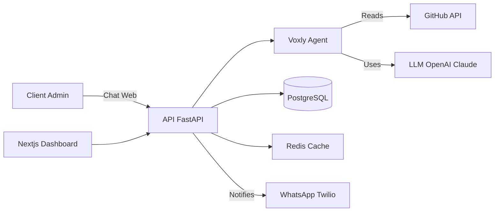

<div align="center">


# 🚀 Voxly

**The Open Source Agency OS**

AI-powered project management, client communication, and automated oversight for modern agencies.

[](LICENSE)
[](https://www.npmjs.com/package/create-voxly)
[](docker-compose.yml)
[](CONTRIBUTING.md)

[Quick Start](#-quick-start) • [Features](#-features) • [Architecture](#-architecture) • [API Reference](http://localhost:8000/docs) • [Docs](https://voxly.dev/docs) • [Contributing](CONTRIBUTING.md)

</div>

---

## ✨ Features

### 🌟 Key Features
- 🤖 **Agentic Reasoning (ReAct)**: Uses "Reason + Act" loops to solve complex queries.
- 👁️ **Multimodal Vision**: Analyze bug screenshots from WhatsApp and open GitHub issues automatically.
- 🛠️ **CLI Orchestrator**: One-command setup and development flow.
- 🔑 **Bring Your Own Key (BYOK)**: Support for Anthropic Claude, OpenAI, and Google Gemini.
- 📱 **WhatsApp Integration**: High-grade client communication via Twilio.

---

## 🚀 Quick Start

The fastest way to get started is via the Voxly CLI:

```bash
# Scaffold your project
npx create-voxly@latest my-agency

# Start the backend
cd my-agency/backend && uvicorn app.main:app --reload

# Start the frontend (new terminal)
cd my-agency/frontend && npm run dev
```

Visit [Installation Docs](https://voxly.dev/docs#getting-started) for detailed setup guides.

| Service | URL |
|---------|-----|
| Frontend | http://localhost:3000 |
| Backend API | http://localhost:8000 |
| API Docs (Swagger) | http://localhost:8000/docs |

---

## 🏗️ Architecture



### Tech Stack

| Layer | Technology |
|-------|-----------|
| **Frontend** | Next.js 16, React 19, Tailwind CSS, Framer Motion |
| **Backend** | FastAPI, SQLAlchemy 2.0, Alembic, Pydantic v2 |
| **AI Engine** | Voxly Agent (ReAct Loop) |
| **LLM Support** | OpenAI (GPT-4), Anthropic (Claude 3.5), Gemini |
| **Database** | PostgreSQL 16 |
| **Cache/Queue** | Redis 7, Celery |
| **DevOps** | Docker, GitHub Actions |

---

## ⚙️ Environment Variables

<details>
<summary>Click to expand full variable reference</summary>

| Variable | Description | Required |
|----------|-------------|----------|
| `DATABASE_URL` | PostgreSQL connection string | ✅ |
| `SECRET_KEY` | JWT signing secret | ✅ |
| `OPENAI_API_KEY` | OpenAI API Key (Primary/Fallback) | ✅ |
| `ANTHROPIC_API_KEY` | Claude API Key (Optional) | |
| `GITHUB_TOKEN` | GitHub Personal Access Token | ✅ |
| `NEXT_PUBLIC_API_URL` | Backend URL | ✅ |

</details>

---

## 📁 Project Structure

```
voxly/
├── backend/               # FastAPI application
│   ├── app/
│   │   ├── api/           # Route handlers
│   │   ├── services/      # AI Agent & Business logic
│   │   └── main.py        # App entrypoint
├── frontend/              # Next.js application
│   ├── app/               # App router pages
│   ├── components/        # Reusable UI components
├── cli/                   # npx create-voxly
├── docker-compose.yml
└── README.md
```

---

## 🤝 Contributing

We welcome contributions! See [CONTRIBUTING.md](CONTRIBUTING.md) for guidelines.

```bash
# Fork → Clone → Branch → Code → Test → PR
git checkout -b feature/amazing-feature
git commit -m "feat: add amazing feature"
git push origin feature/amazing-feature
```

---

## 📄 License

MIT License — see [LICENSE](LICENSE) for details.

---

<div align="center">

**Built with ❤️ by the Voxly Team**

[⭐ Star this repo](https://github.com/ravin972/voxly-backend) • [🐛 Report Bug](https://github.com/ravin972/voxly-backend/issues)

</div>
