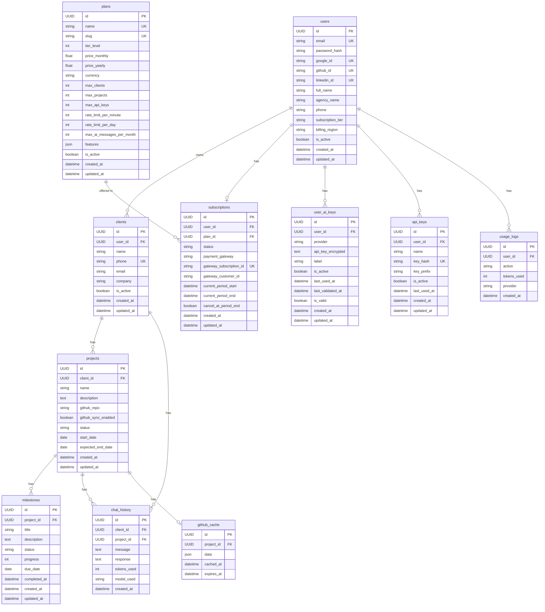

# Voxly — Database Schema Reference

## Overview

Voxly uses **PostgreSQL** (via Supabase in production, Docker locally).  
ORM: **SQLAlchemy 2.0**. Migrations: **Alembic**.  
All primary keys are **UUID v4**. All timestamps are **UTC**.

---

## Entity-Relationship Diagram



---

## Table Reference

### `users`
Primary tenant table. Each record is one agency.

| Column | Type | Notes |
|--------|------|-------|
| `id` | UUID PK | Auto-generated |
| `email` | VARCHAR(255) UNIQUE | Login identifier |
| `password_hash` | VARCHAR(255) NULL | Null for OAuth-only users |
| `google_id` | VARCHAR(255) UNIQUE NULL | Google OAuth |
| `github_id` | VARCHAR(255) UNIQUE NULL | GitHub OAuth |
| `linkedin_id` | VARCHAR(255) UNIQUE NULL | LinkedIn OAuth |
| `full_name` | VARCHAR(255) NULL | |
| `agency_name` | VARCHAR(255) NULL | Shown in AI prompts |
| `phone` | VARCHAR(50) NULL | Owner contact |
| `subscription_tier` | VARCHAR(50) DEFAULT `'free'` | Legacy; use `subscriptions` table |
| `billing_region` | VARCHAR(10) DEFAULT `'INTL'` | `'IN'`=Razorpay, `'INTL'`=Stripe |
| `is_active` | BOOLEAN DEFAULT `true` | Account enabled |

---

### `clients`
Agency's customers. Each sends messages via WhatsApp.

| Column | Type | Notes |
|--------|------|-------|
| `id` | UUID PK | |
| `user_id` | UUID FK → users | Tenant FK |
| `name` | VARCHAR(255) | Client display name |
| `phone` | VARCHAR(50) UNIQUE INDEX | Used for WhatsApp lookup |
| `email` | VARCHAR(255) NULL | |
| `company` | VARCHAR(255) NULL | |
| `is_active` | BOOLEAN | Inactive = won't get AI replies |

> **Important:** `phone` must include country code (e.g. `+919876543210`). This is the primary lookup key when a WhatsApp message arrives.

---

### `projects`
A client can have multiple projects. Only one `active` project is used for AI context.

| Column | Type | Notes |
|--------|------|-------|
| `id` | UUID PK | |
| `client_id` | UUID FK → clients | |
| `name` | VARCHAR(255) | |
| `description` | TEXT NULL | Gives AI context |
| `github_repo` | VARCHAR(255) NULL | Format: `owner/repo` |
| `github_sync_enabled` | BOOLEAN DEFAULT `true` | |
| `status` | VARCHAR(50) DEFAULT `'active'` | `active`, `paused`, `completed`, `cancelled` |
| `start_date` | DATE NULL | |
| `expected_end_date` | DATE NULL | |

---

### `milestones`
Progress checkpoints within a project.

| Column | Type | Notes |
|--------|------|-------|
| `id` | UUID PK | |
| `project_id` | UUID FK → projects | |
| `title` | VARCHAR(255) | |
| `description` | TEXT NULL | |
| `status` | VARCHAR(50) DEFAULT `'pending'` | `pending`, `in_progress`, `completed`, `blocked` |
| `progress` | INTEGER DEFAULT `0` | 0–100 percent |
| `due_date` | DATE NULL | |
| `completed_at` | DATETIME NULL | Set when status → completed |

---

### `chat_history`
Every WhatsApp message/AI reply pair is stored here.

| Column | Type | Notes |
|--------|------|-------|
| `id` | UUID PK | |
| `client_id` | UUID FK → clients | Cascade delete |
| `project_id` | UUID FK → projects NULL | SET NULL on project delete |
| `message` | TEXT | Client's inbound message |
| `response` | TEXT | AI's reply |
| `tokens_used` | INTEGER DEFAULT `0` | For billing |
| `model_used` | VARCHAR(100) NULL | e.g. `gpt-4o`, `claude-3-5-sonnet` |

---

### `plans`
Available subscription tiers (seeded from `seed_plans.py`).

| Tier | `slug` | `tier_level` | Clients | Projects | AI Msgs/mo |
|------|--------|-------------|---------|----------|-----------|
| Free | `free` | 0 | 5 | 3 | 50 |
| Pro | `pro` | 1 | 25 | 15 | 500 |
| Enterprise | `enterprise` | 2 | Unlimited | Unlimited | Unlimited |

---

### `subscriptions`
Links users to plans with payment gateway info.

| Column | Type | Notes |
|--------|------|-------|
| `status` | VARCHAR(50) | `active`, `cancelled`, `past_due`, `trialing`, `expired` |
| `payment_gateway` | VARCHAR(20) NULL | `stripe` or `razorpay` |
| `gateway_subscription_id` | VARCHAR(255) UNIQUE NULL | Stripe `sub_xxx` or Razorpay ID |

---

### `user_ai_keys`
BYOK — users can provide their own AI API keys which are stored encrypted.

| Column | Type | Notes |
|--------|------|-------|
| `provider` | VARCHAR(50) | `claude`, `openai`, `gemini`, `groq`, `ollama` |
| `api_key_encrypted` | TEXT | AES-256 encrypted, key from `SECRET_KEY` |
| `is_valid` | BOOLEAN NULL | `null`=not checked, `true/false`=last check |

---

## Alembic Migrations

```bash
# Check current state
alembic current

# Generate a new migration after model change
alembic revision --autogenerate -m "add soft delete columns"

# Apply all pending migrations
alembic upgrade head

# Rollback one step
alembic downgrade -1
```

Migration files are in `backend/alembic/versions/`.  
**Never edit an applied migration.** Create a new one instead.
