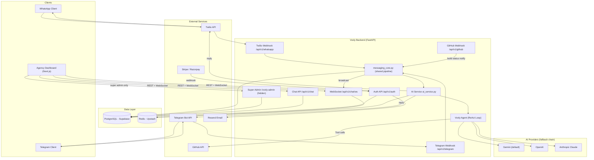
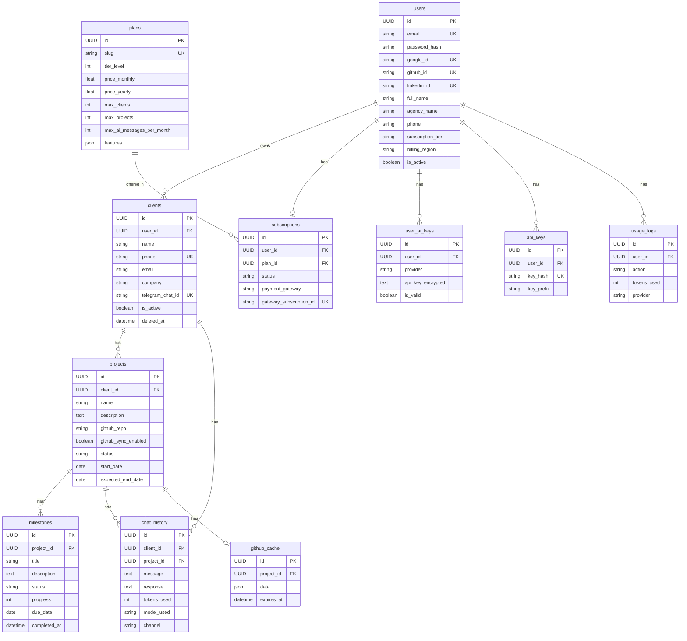
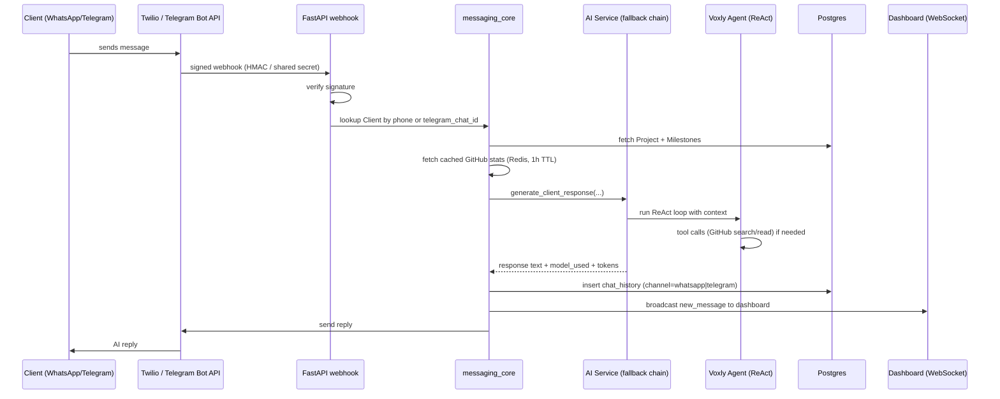
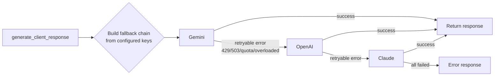
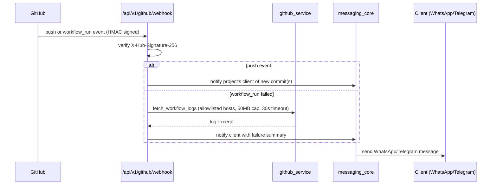

# Voxly — Engineering Onboarding (PRD / BRD / Architecture)

> **Audience**: New engineers joining the Voxly project.
> **Status**: Reconciled against codebase as of `2026-06-16` (commit `7fea504`). Where existing docs in `docs/` and `docs/strategy/` were stale or aspirational, this doc calls that out explicitly rather than repeating it as fact.

---

## 0. TL;DR

Voxly is an **"Agency OS"**: an agency owner manages clients, projects, and milestones in a dashboard, and an **AI agent answers client status questions over WhatsApp / Telegram** using real GitHub data (commits, issues, PRs). GitHub webhooks also push build/CI status to clients automatically.

Stack: **FastAPI (Python 3.12) + PostgreSQL (Supabase) + Redis + Next.js 14**, deployed on **Google Cloud Run (backend)**, **Vercel (frontend)**, **Supabase (DB)**, **Upstash (Redis)**.

Open-core model: `voxly-oss/voxly-oss` (public, MIT) is the OSS engine; a private monorepo carries the SaaS-specific/enterprise bits (super admin, billing).

---

## 1. PRD — Product Requirements

### 1.1 Problem statement

Dev agencies (and similar service businesses) spend significant time every day fielding the same client question in different words: *"What's the status of my project?"* This is manual, repetitive, and pulls developers out of flow to answer.

### 1.2 Target users / personas

| Persona | Who | What they do in Voxly |
|---|---|---|
| **Agency owner / admin** | Runs a dev agency, 5–50 clients | Logs into the dashboard, manages clients/projects/milestones, links GitHub repos, configures AI provider (BYOK), views chat history and usage |
| **End client** | The agency's customer | Never logs in — messages the agency's WhatsApp or Telegram number and gets an AI-generated status reply |
| **Super admin** (Voxly operator) | Platform operator, gated by `SUPER_ADMIN_EMAIL` + `X-Admin-Secret` header | Cross-tenant visibility: list all tenants, system stats, override plans, impersonate users, view platform activity (`/voxly-admin`, hidden from OpenAPI schema) |

### 1.3 Core features (current, implemented)

- **Client / Project / Milestone CRUD** — standard tenant-scoped resources.
- **AI client chat over WhatsApp and Telegram** — a single shared pipeline (`messaging_core.py`) handles both channels: looks up the `Client` by phone (WhatsApp) or `telegram_chat_id` (Telegram), pulls the linked `Project` + cached GitHub stats + milestones, generates a response, persists to `chat_history` (tagged with `channel`), and broadcasts to the dashboard over WebSocket.
- **GitHub integration** — push and `workflow_run` webhooks. On push, notifies the client; on CI failure, fetches and analyzes logs before notifying.
- **AI agent (ReAct)** — agency owner can chat with the AI directly (`/api/v1/ai/chat`), and the agent can call tools: search GitHub issues, read repo files, create issues, search local docs.
- **BYOK (Bring Your Own AI Key)** — users can store their own Anthropic / OpenAI / Gemini / Groq / Ollama keys (AES/Fernet-encrypted), validated on demand.
- **AI provider auto-fallback** — if the primary provider returns a retryable error (rate limit, 429, overloaded, etc.), the pipeline automatically tries the next configured provider. Default chain order (when all keys present): **Gemini → OpenAI → Claude**, with `gemini` as the hardcoded default if nothing is configured.
- **Auth** — JWT (email/password) + OAuth (Google, GitHub, LinkedIn). Password reset flow exists (currently logs the reset link server-side rather than emailing it — see §8).
- **Billing scaffolding** — Stripe (international) / Razorpay (India, via `billing_region`) checkout + portal endpoints, `Plan`/`Subscription`/`UsageLog` models.
- **Real-time dashboard** — authenticated WebSocket pushes new messages to the agency dashboard as they happen.
- **Super admin console** — cross-tenant stats, plan overrides, impersonation, activity feed.

### 1.4 Explicitly NOT current (roadmap / aspirational — do not assume these exist)

`docs/strategy/ai_architecture_v2.md` ("Godfather Edition") describes a **future** architecture: a semantic intent router, a multi-step planning ReAct loop with long-term `pgvector` memory, and human-in-the-loop write actions. **None of this is built yet.** The current agent is a single-tier ReAct loop with read-mostly GitHub tools and no vector memory. Treat that doc as a design proposal, not a description of the running system.

### 1.5 Non-goals (per `docs/strategy/voxly_scaling_investor_social_strategy.md`)

GraphQL is explicitly deferred — REST is sufficient until there's a second frontend client (mobile/public API).

---

## 2. BRD — Business Requirements

### 2.1 Business model

Open-core: the engine is open source (self-hostable, free). Cloud/hosted plans are tiered (per `backend/app/scripts/seed_plans.py`, the source of truth — **`docs/DATABASE.md`'s plan table is stale, do not use it**):

| Tier | `slug` | Price/mo (USD) | Clients | Projects | AI msgs/mo | API keys | Notable features |
|---|---|---|---|---|---|---|---|
| Free | `free` | $0 | 5 | 3 | 50 | 1 | github_sync, whatsapp_bot, api_access |
| Pro | `pro` | $29 | 50 | 100 | 1,000 | 5 | + custom_branding, priority_support, webhooks, analytics |
| Enterprise | `enterprise` | $99 | 500 | 1,000 | 10,000 | 20 | + dedicated_support, SLA, custom_integrations, multi_channel |

Billing currency/gateway is selected per-user via `billing_region` (`IN` → Razorpay, `INTL` → Stripe). `seed_plans.py` is idempotent and **updates existing rows on rerun** — if you change these numbers, rerun the seed script (or write a migration) to apply them.

### 2.2 Market framing (treat as strategy, not fact)

`docs/strategy/voxly_scaling_investor_social_strategy.md` frames the wedge as **dev agencies in India** ("Project kab hoga?" via WhatsApp), with a stated expansion path to design agencies → freelancers → construction → legal/CA → education → healthcare → white-label. The revenue projections in that doc (₹15L MRR Year 1, etc.) are **investor-pitch numbers, not validated metrics** — a new engineer should not treat them as targets or current traction. Useful for understanding *why* certain features exist (e.g., WhatsApp-first, India billing region), not as a roadmap commitment.

### 2.3 Success metrics worth knowing

The dashboard (`GET /api/v1/dashboard`) already tracks the metrics the business cares about operationally: `total_clients`, `active_projects`, `messages_today`, `tokens_used_today`. `usage_logs` table is the source for AI cost/usage tracking and plan-limit enforcement.

---

## 3. Architecture

### 3.1 High-level design



### 3.2 API routers (13 total)

| Prefix | File | Responsibility |
|---|---|---|
| `/api/v1/auth` | `auth.py` | JWT auth, OAuth (Google/GitHub/LinkedIn), password reset |
| `/api/v1/clients` | `clients.py` | CRUD for client accounts |
| `/api/v1/projects` | `projects.py` | CRUD for projects + GitHub link |
| `/api/v1/milestones` | `milestones.py` | Milestone tracking |
| `/api/v1/chat` | `chat.py` | Chat history + WebSocket |
| `/api/v1/whatsapp` | `whatsapp.py` | Twilio inbound webhook → `messaging_core` |
| `/api/v1/telegram` | `telegram.py` | Telegram inbound webhook → `messaging_core` |
| `/api/v1/github` | `github.py` | GitHub push/CI webhooks |
| `/api/v1/billing` | `billing.py` | Stripe + Razorpay |
| `/api/v1/notifications` | `notifications.py` | Custom WhatsApp follow-ups |
| `/api/v1/dashboard` | `dashboard.py` | Aggregate stats for UI |
| `/api/v1/ai` | `ai.py` | Admin AI chat endpoint (ReAct agent) |
| `/api/v1/ai-keys` | `ai_keys.py` | BYOK key management |
| `/voxly-admin` | `super_admin.py` | Cross-tenant ops (hidden from schema) |

### 3.3 Security middleware stack (applied in order, `main.py`)

1. **CORS** — allowlist of `FRONTEND_URL` + `localhost:3000`/`3001` (not a wildcard).
2. **Security headers middleware** — `X-Content-Type-Options`, `X-Frame-Options: DENY`, `Referrer-Policy`, `Content-Security-Policy`, `Permissions-Policy`, and `Strict-Transport-Security` (on HTTPS requests).
3. **Rate limiting** — `slowapi`, per-route limits (e.g. `register` 5/min, `login` 10/min, AI chat 20/min, notifications 10/min, password-reset 3/min).
4. **JWT authentication** — `Depends(get_current_user)` on protected routes.
5. **Tenant isolation** — every query filters by `user_id` (or the FK chain back to it). Verified with cross-tenant isolation tests in `tests/test_clients.py`.
6. **Webhook signature verification** — Twilio (`X-Twilio-Signature`), GitHub (`X-Hub-Signature-256` HMAC), Telegram (shared-secret header), and internal service-to-service calls (`X-Voxly-Webhook-Token` vs `INTERNAL_WEBHOOK_SECRET`).

### 3.4 Multi-tenancy model

```
User (tenant)
  └── Clients              (user_id FK)
        └── Projects       (client_id FK)
              └── Milestones
              └── Chat History (channel: whatsapp | telegram)
  └── API Keys
  └── Subscription
  └── Usage Logs
  └── AI Keys (BYOK)
```

A user can never see another user's clients/projects/chats. Cascade deletes are configured (deleting a user removes all their data). `Client` also has a `deleted_at` column — **soft delete is supported on clients**, so "deleted" clients may still exist in the DB; query accordingly.

---

## 4. Data Model



Key things that bit people before:
- `clients.phone` and `clients.telegram_chat_id` are both **unique lookup keys** — the same client can be reached via either channel, and `messaging_core` looks up by whichever identifier the inbound message carries.
- `chat_history.channel` defaults to `"whatsapp"` but is now `"whatsapp" | "telegram"`.
- ORM: SQLAlchemy 2.0, migrations via Alembic (`backend/alembic/versions/`). **Never edit an applied migration** — create a new one.

---

## 5. Key Flows

### 5.1 Inbound message → AI reply (WhatsApp or Telegram)



### 5.2 AI provider fallback



Default order is **Gemini → OpenAI → Claude** based on which `*_API_KEY` env vars / BYOK keys are configured; `gemini` is the hardcoded fallback if none are set. Only "retryable" errors (rate limits, overload, quota, 429/503) advance the chain — other errors fail fast.

### 5.3 GitHub webhook → client notification



---

## 6. Security Posture (current)

This codebase went through multiple hardening passes (see `CLAUDE.md` for full history). What a new engineer should know is in place **today**:

- CORS locked to an allowlist (not `*`).
- GitHub, Twilio, and Telegram webhooks are all signature/secret-verified; invalid signatures → `401`.
- Internal service-to-service calls (e.g. WhatsApp handler calling chat logic) use `INTERNAL_WEBHOOK_SECRET` + `secrets.compare_digest`.
- SSRF guards on outbound fetches (`img_url` downloads, GitHub log URLs): host allowlists, timeouts, size caps.
- BYOK keys encrypted at rest (Fernet/AES), with a legacy decrypt path preserved for older records.
- Rate limiting via `slowapi` on auth, AI, and notification endpoints.
- PII (phone numbers, message bodies) is not logged at INFO level.
- Swagger/ReDoc disabled when `DEBUG=False`.

**Known open items** (don't assume these are fixed unless you check):
- Password reset still logs the token server-side — no email transport wired for the reset link itself (Resend is used for *other* emails).
- JWT tokens aren't scoped by audience/issuer.
- WebSocket auth token is passed as a query param (`?token=<jwt>`), which lands in access logs.
- Test coverage is thin — backend has a real suite (`tests/test_clients.py`, `tests/test_github_webhook.py`, `test_auth.py`, etc.) but coverage is still low overall, and frontend has effectively none.

---

## 7. Scaling

### 7.1 Near-term technical scaling (grounded)

Current production topology:

| Component | Provider |
|---|---|
| Backend | Google Cloud Run (`voxly-backend`, scales to zero) |
| Database | Supabase Postgres (Mumbai region), via pooler connection |
| Frontend | Vercel |
| Redis | Upstash |

Things to know:
- Cloud Run cold starts (~2-3s) are expected when idle — don't be alarmed by first-request latency.
- DB connection string **must** use the Supabase pooler host (`aws-1-ap-south-1.pooler.supabase.com:5432`), not the direct `db.xxx.supabase.co` host — direct host fails DNS resolution in some environments.
- `env.yaml` (gitignored) holds Cloud Run env vars and must be kept manually in sync with `.env` before redeploys.

### 7.2 Product/market scaling (strategic vision, not committed roadmap)

`docs/strategy/voxly_scaling_investor_social_strategy.md` lays out a horizontal-expansion thesis: the core engine (AI + messaging + project tracking) is industry-agnostic. **Everything below is pitch material — framing for "why the architecture is shaped this way," not a backlog or set of OKRs.** No traction numbers in this section are real; they're investor-deck placeholders.

**Expansion thesis** — same engine, different verticals, each with the same underlying need ("what's the status of my X?"):

| Phase | Vertical | Mechanism | Illustrative target |
|---|---|---|---|
| Year 1 (current) | Dev agencies | GitHub-backed status via WhatsApp | 500 agencies × ₹3K/mo = ₹15L MRR |
| Year 1.5 | Design & creative agencies | Same pain point, non-code clients | 300 agencies × ₹3K/mo = +₹9L MRR |
| Year 2 | Freelancers & consultants | Lower-priced solo tier | 2,000 users × ₹1K = +₹20L MRR |
| Year 2 | Construction & architecture firms | Replace GitHub with manual milestones | 200 firms × ₹5K/mo = +₹10L MRR |
| Year 3 | Legal & CA firms | Case/filing status via WhatsApp | 500 firms × ₹3K/mo = +₹15L MRR |
| Year 3 | Education & coaching | Student progress updates to parents | 1,000 institutes × ₹2K = +₹20L MRR |
| Year 4 | Healthcare (clinics/hospitals) | Patient follow-up + appointment reminders | Needs regulatory compliance work first |
| Year 5 | White-label platform | Any business self-deploys Voxly | Enterprise licensing ₹50K–₹2L/mo |

**Illustrative revenue trajectory** (from the same doc — treat as a model, not a forecast):

| Timeline | Market | Users | MRR | ARR |
|---|---|---|---|---|
| Month 6 | Dev agencies | 50 | ₹1.5L | ₹18L |
| Year 1 | + Design agencies | 200 | ₹6L | ₹72L |
| Year 2 | + Freelancers + Construction | 1,000 | ₹25L | ₹3Cr |
| Year 3 | + Legal + Education | 3,000 | ₹60L | ₹7.2Cr |
| Year 5 | White-label platform | 10,000 | ₹2Cr+ | ₹24Cr+ |

**Why this scales (stated rationale)**: WhatsApp's reach in India (500M+ users) makes the channel industry-agnostic; the AI layer doesn't care whether it's discussing a GitHub issue or a construction milestone; open-source builds trust for self-hosting/audit; "Powered by Voxly" footers on outbound messages create organic discovery loops as each agency's clients become aware of the product.

**Comparable open-core companies cited**: Cal.com (open-source Calendly, $32M+ raised), Chatwoot (open-source Intercom, $12M+ raised), n8n (open-source Zapier, $50M+ raised), Papermark (open-source DocSend, $900K ARR). Useful as reference points for the open-core model, not as Voxly's current stage.

**The architectural implication that *is* actionable today**: avoid hardcoding "GitHub" or "dev agency" assumptions into core services where avoidable. `messaging_core` and the AI agent's tool abstraction already lean this way (tools are pluggable; GitHub is just the current toolset) — keep extending new functionality through that same seam rather than special-casing it.

**On GraphQL** (also from this doc): explicitly deferred. Decision criteria for revisiting: a mobile app, a public third-party API, or a dashboard whose data requirements outgrow REST. If/when it happens, the doc recommends **Strawberry** (integrates natively with FastAPI).

### 7.3 AI architecture roadmap

The `ai_architecture_v2.md` "Godfather" direction (semantic intent router to avoid burning tokens on greetings, multi-step ReAct planning, short-term Redis memory + long-term pgvector memory, human-in-the-loop confirmation for write actions like merging PRs) is the planned next step for the AI layer specifically — useful context for anyone picking up agent work, but again: **not yet built**. The current agent is a single-tier ReAct loop with read-mostly GitHub tools, no semantic router, and no vector memory.

---

## 8. Dev Environment Setup (condensed — see `docs/SETUP.md` for full detail)

```bash
git clone https://github.com/voxly-oss/voxly-oss.git
cd voxly-oss
cp backend/.env.example backend/.env   # fill in secrets
docker compose up                       # Postgres + Redis + backend + frontend
```

Manual/hot-reload path:
```bash
# Backend
cd backend
python -m venv venv && source venv/bin/activate   # or .\venv\Scripts\activate on Windows
pip install -r requirements.txt
alembic upgrade head
python -m app.scripts.seed_plans   # seed Free/Pro/Enterprise plans
uvicorn app.main:app --reload --port 8000

# Frontend
cd frontend
npm install && npm run dev
```

Minimum required env vars: `DATABASE_URL`, `SECRET_KEY`, `INTERNAL_WEBHOOK_SECRET`, and **at least one** of `ANTHROPIC_API_KEY` / `OPENAI_API_KEY` / `GEMINI_API_KEY`. WhatsApp/Telegram/GitHub/billing integrations each need their own credentials but aren't required to boot the app.

Run tests: `cd backend && pytest -v`.

---

## 9. New Engineer Checklist (first week)

1. Get the stack running locally via Docker Compose; confirm `GET /health` returns `200` and frontend loads at `localhost:3000`.
2. Read `docs/API_CONTRACT.md` and `docs/DATABASE.md` — these are accurate and current.
3. Trace one real message through the system: send a test WhatsApp/Telegram message (or fake the webhook payload locally) and follow it through `whatsapp.py`/`telegram.py` → `messaging_core.py` → `ai_service.py` → `ai_agent.py` → back out. This is the most-touched code path.
4. Run `pytest -v` in `backend/` and read `tests/test_clients.py` to understand the multi-tenancy isolation pattern — every new endpoint needs to respect it.
5. Check `CLAUDE.md` for the most recent operational history — it's the living engineering log and will tell you what's fresh vs. stable.
6. Before touching the AI agent, read §1.4 above — don't conflate the current ReAct loop with the v2 "Godfather" design doc.
7. If you're working on anything cross-tenant (super admin, billing), read `super_admin.py`'s `require_super_admin` guard first — it's dual-factor (email allowlist + header secret) and easy to misuse.
