# Voxly Target Architecture — Enterprise SaaS Evolution

> **Status:** Proposed · **Owner:** Chief Software Architect · **Horizon:** ~12 months, incremental
> **Prime directive:** Deployable at every step. No big-bang rewrite. Every phase ships independently and onboards customers.

This document defines the target architecture for evolving Voxly from a successful single-tenant MVP into a multi-tenant SaaS platform serving **thousands of organizations**. It is grounded in the current codebase (`backend/app/**`), not a greenfield fantasy. The migration plan (§23) is designed so we never stop shipping features and never take the product offline.

---

## 0. Guiding principles

1. **Modular monolith first, microservices only where forced.** The current FastAPI app is fine. We refactor it into clean bounded modules *inside one deployable*, and extract a service only when scale, isolation, or team boundaries demand it. Distributed systems are a tax; pay it deliberately.
2. **The tenant boundary must move from `User` to `Organization`.** This is the single most important change and everything else depends on it.
3. **Strangler-fig migration.** New abstractions wrap old code; we cut over path by path behind flags. Old and new coexist.
4. **Expand–migrate–contract for every schema change.** Add columns/tables → backfill → dual-write → cut reads over → drop old. No destructive migration in a single deploy.
5. **Isolation by construction, not by discipline.** Today isolation depends on every developer remembering `.filter(user_id == current_user.id)`. That is a data-leak waiting to happen. The target enforces tenancy in a single choke point.

---

## 1. Current architecture assessment

### 1.1 What exists today (grounded in the repo)

```
FastAPI monolith (backend/app)
├── api/v1/*            22 routers: auth, clients, projects, milestones, chat,
│                        whatsapp, telegram, github, ai, ai_keys, api_keys,
│                        billing, notifications, dashboard, super_admin
├── models/*            SQLAlchemy: User, Client, Project, Milestone, ChatHistory,
│                        Plan, Subscription, UsageLog, APIKey, UserAIKey, GitHubCache
├── services/*          ai_agent, ai_providers/{claude,openai,gemini}, github_service,
│                        whatsapp_service, telegram_service, messaging_core,
│                        notification_service, email_service, cache_service
├── tasks/*             Celery (celery_app, github_sync) — present but thin
├── tools/*             AI tool-calling: github_tools, kb_tools
├── websockets/manager  In-process WebSocket connection manager
└── utils/*             auth (JWT), api_key_auth, usage_tracker, rate_limiter, phone
```

**Runtime (from CLAUDE.md operational log):**

| Concern | Current |
|---|---|
| Compute | Google Cloud Run (`voxly-backend`, scales to 0) |
| DB | Supabase Postgres (Mumbai), single instance, connection via pooler |
| Cache/broker | Upstash Redis |
| Frontend | Vercel (Next.js) |
| Async | Celery (minimal usage) |
| Payments | Stripe + Razorpay (region-split: `billing_region` `IN`/`INTL`) |
| Messaging | Twilio WhatsApp (sandbox), Telegram |
| AI | BYOK Fernet-encrypted keys; Claude/OpenAI/Gemini providers |

### 1.2 The central structural gap: no tenant

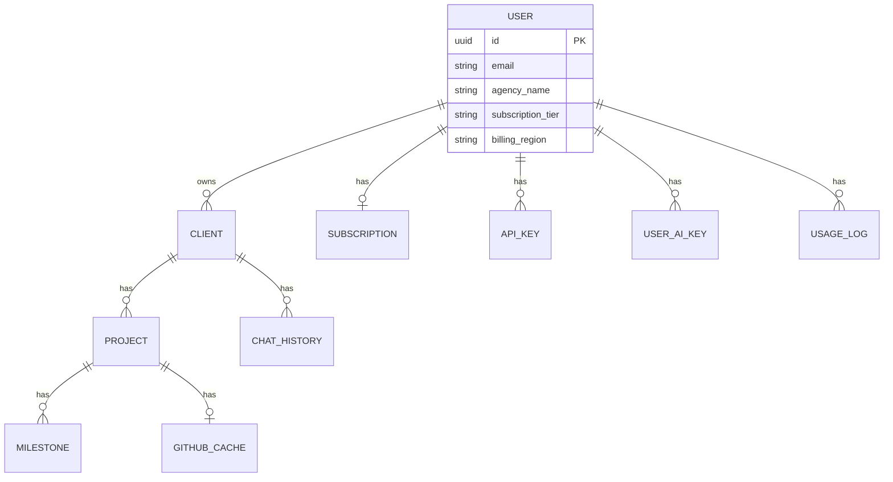

**`User` *is* the tenant.** Isolation is enforced by manual `WHERE user_id = current_user.id` clauses scattered across every router (e.g. `clients.py` phone-uniqueness scoping fixes recorded in the log). Implications:

- **One human = one agency = one billing account = one tenant.** No teams, no seats, no "invite a colleague," no separation of *who pays* from *who uses*.
- **No role model.** Authorization is binary (authenticated or not) plus a bolt-on `super_admin` router. There is no "admin vs member vs billing-owner vs read-only client."
- **Isolation is a per-query manual invariant.** The audit log already records cross-tenant leaks (global phone lookup leaking existence across users; GitHub webhook notifying "first random user with a phone"). These are symptoms of tenancy-by-discipline.

### 1.3 Scorecard

| Dimension | Today | Target | Gap |
|---|---|---|---|
| Multi-tenancy | Implicit via `user_id` | Explicit `org_id`, enforced centrally | **Critical** |
| Org / teams / seats | None | Orgs + memberships + invites | **Critical** |
| RBAC | Binary + super_admin | Roles + permissions + scopes | **High** |
| Module boundaries | Routers call models/services freely | Bounded modules, explicit contracts | **High** |
| Eventing | Synchronous, in-process | Event bus + outbox | **High** |
| Background work | Thin Celery | First-class worker tier | Medium |
| Search | None (SQL `LIKE`) | Dedicated search index | Medium |
| File storage | None | Object storage + signed URLs | Medium |
| Observability | Cloud Run logs, SonarCloud | Traces + metrics + structured logs + SLOs | **High** |
| Caching | Ad-hoc `cache_service` + `github_cache` table | Layered, tenant-aware cache | Medium |
| API gateway | None (Cloud Run direct) | Edge gateway: authn, rate-limit, routing | Medium |
| Deploy | Single Cloud Run service | Multi-service, IaC, staged | Medium |

**Verdict:** The MVP is a healthy, security-hardened monolith with good instincts (JWT with iss/aud, Fernet BYOK, webhook signature verification, rate limiting). It is *not* structurally ready for multi-org SaaS because tenancy and identity are modeled at the wrong grain. The evolution is primarily a **data-model and boundary** problem, not a rewrite.

---

## 2. Target architecture (system view)

We target a **modular monolith + satellite workers**, fronted by an edge gateway, backed by Postgres with a tenant-aware access layer, an event backbone, and pluggable infrastructure for search/storage/AI.

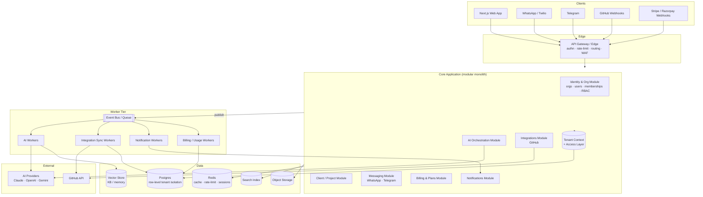

**Key moves vs today:**
- A **Tenant Context + Access Layer** becomes the *only* path to tenant data. Isolation stops being per-query discipline.
- Synchronous integration/AI work moves onto a **worker tier** fed by an **event bus with a transactional outbox**.
- Cross-cutting infra (search, object storage, vector) is introduced behind module interfaces so it can be swapped.

---

## 3. Multi-tenant data model

### 3.1 Strategy: shared database, shared schema, row-level isolation by `org_id`

For thousands of small-to-mid orgs, **shared schema with an `org_id` discriminator** is the right default: cheapest to operate, easiest to migrate to from today's `user_id` model, and Postgres RLS can enforce it in the engine. Schema-per-tenant or db-per-tenant are reserved for a future **Enterprise isolation tier** (§11.4) and are opt-in, not the default.

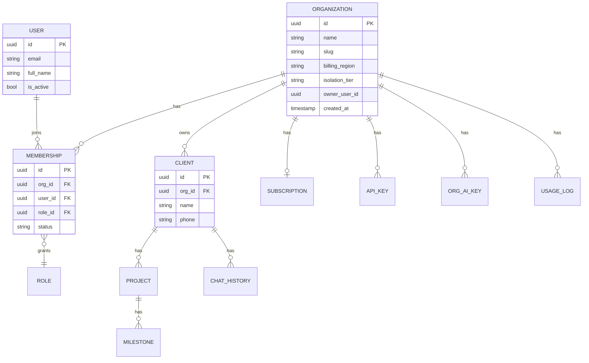

### 3.2 The invariant

> **Every tenant-owned row carries `org_id`. Every read and write is scoped by the active `org_id` from the request context — enforced in one place, not per query.**

- **`User` becomes global identity** (a person, possibly a member of several orgs). `email` stays unique globally; `agency_name`/`subscription_tier`/`billing_region` **move to `Organization`**.
- **`Client`, `Project` (via client), `APIKey`, `Subscription`, `UsageLog`, `UserAIKey`→`OrgAIKey`, `ChatHistory`, `GitHubCache`** all gain `org_id` (directly or via a tenant-owned parent).
- **`phone` uniqueness** changes from global-unique to **unique per `org_id`** (the log already flags the global-unique index as a cross-tenant leak).

### 3.3 Enforcement (choke point)

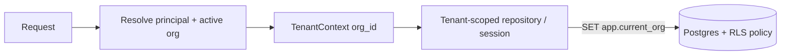

Two layers, defense in depth:
1. **Application layer:** a `TenantSession`/repository wrapper injects `org_id` into every query. Routers can no longer obtain a raw session.
2. **Database layer:** Postgres **Row-Level Security** policies (`USING (org_id = current_setting('app.current_org')::uuid)`) so a bug in app code cannot cross tenants. `SET LOCAL app.current_org` per transaction.

This converts the current "remember to filter" model into "impossible to not filter."

---

## 4. Organization model

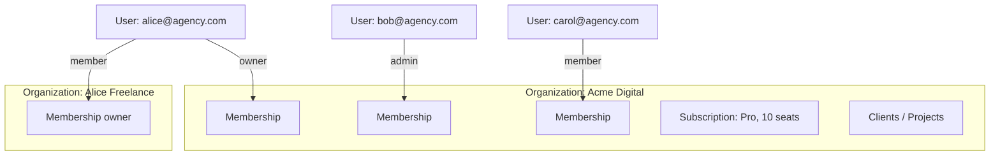

- **Organization** = the tenant, the billing unit, the isolation boundary. Has a `slug`, region, plan, seat count, and `isolation_tier` (`shared` default; `dedicated` for enterprise).
- **User** = a global person. A user can belong to **many** organizations (freelancer with own org + contractor on a client's org).
- **Membership** = the join: `(org_id, user_id, role, status)`. `status` ∈ `invited | active | suspended`. Seat consumption counts `active` memberships against the plan's seat limit.
- **Invitations** = pending memberships created by email; accepted on signup/login. Enables team growth without a rewrite of auth.
- **Owner transfer & offboarding** are first-class (removing a user must not orphan an org or its billing).
- **Personal org on signup:** every new user gets an auto-provisioned personal org — this is exactly today's model, so existing users migrate 1:1 (one user → one org) with zero UX change (§23 Phase 1).

---

## 5. RBAC model

### 5.1 Model: roles → permissions, scoped to an org

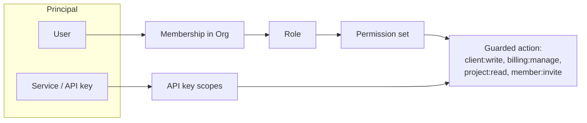

**Default roles (per org):**

| Role | Capability summary |
|---|---|
| **Owner** | Everything incl. billing, delete org, transfer ownership |
| **Admin** | Manage clients/projects/integrations/members; not billing-delete |
| **Member** | CRUD clients/projects they can access; no member/billing management |
| **Billing** | Billing + read-only elsewhere |
| **Read-only / Viewer** | Read dashboards & projects |
| **Client (external)** | Scoped to their own projects via messaging — *not* a dashboard seat |

**Permission catalog** is a flat set of `resource:action` strings (`client:read`, `client:write`, `project:delete`, `member:invite`, `billing:manage`, `integration:connect`, `ai_key:manage`, `org:admin`). Roles map to permission sets. This is far more flexible than hardcoded tiers and lets us add custom roles for enterprise later.

**Enforcement:** a single `require(permission)` dependency replaces scattered auth checks. `super_admin` becomes a **platform-level** role (Voxly staff), cleanly separated from org roles, with its own audited access path (replacing the ad-hoc `super_admin` router).

**API keys** carry **scopes** (a subset of permissions) and are bound to an `org_id` — an org API key can never act outside its org.

---

## 6. Domain boundaries

Domains are the business capabilities. Each owns its data and exposes contracts; cross-domain access goes through interfaces/events, never by reaching into another domain's tables.

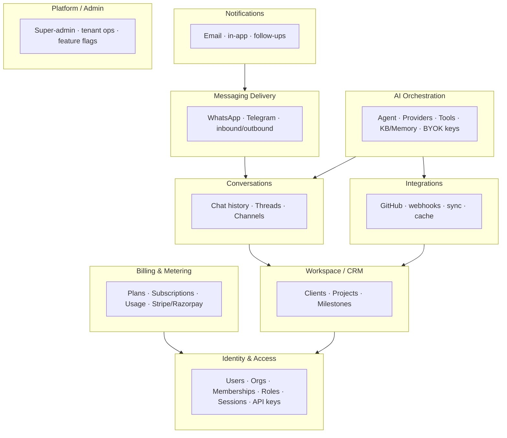

**Ownership map (current file → target domain):**

| Domain | Owns (target) | Current files |
|---|---|---|
| Identity & Access | User, Organization, Membership, Role, APIKey | `auth.py`, `utils/auth.py`, `api_keys.py`, `super_admin.py` |
| Workspace/CRM | Client, Project, Milestone | `clients.py`, `projects.py`, `milestones.py`, `dashboard.py` |
| Conversations | ChatHistory, threads | `chat.py`, `messaging_core.py` |
| AI Orchestration | Agent, providers, tools, KB, OrgAIKey | `ai.py`, `ai_keys.py`, `services/ai_*`, `tools/*` |
| Integrations | GitHub sync/cache | `github.py`, `github_service.py`, `github_cache`, `tasks/github_sync.py` |
| Messaging | WhatsApp/Telegram delivery | `whatsapp.py`, `telegram.py`, `whatsapp_service.py`, `telegram_service.py` |
| Billing | Plans, Subscriptions, Usage | `billing.py`, `models/{plan,subscription,usage_log}`, `usage_tracker.py` |
| Notifications | Email, follow-ups | `notifications.py`, `notification_service.py`, `email_service.py` |
| Platform | Admin, flags | `super_admin.py` |

---

## 7. Module boundaries (physical, inside the monolith)

We restructure `backend/app` from **layer-first** (`api/`, `models/`, `services/`) to **domain-first** modules, each with a stable public interface. This is the refactor that makes later service-extraction cheap.

```
backend/app/
├── platform/                 # cross-cutting: config, db, tenant context, events, telemetry
│   ├── tenant.py             # TenantContext + scoped session (THE choke point)
│   ├── events.py             # event bus + outbox
│   ├── rbac.py               # require(permission)
│   └── observability.py
├── modules/
│   ├── identity/             # api/ · domain/ · repo/ · service.py · public.py
│   ├── workspace/
│   ├── conversations/
│   ├── ai/
│   ├── integrations_github/
│   ├── messaging/
│   ├── billing/
│   └── notifications/
└── main.py                   # composition root: wires modules + routers
```

**Rules (enforced by lint/import-linter):**
- A module exposes only `public.py` (functions/DTOs/events). Other modules import *that*, never another module's `repo/` or `domain/`.
- Only `platform/tenant.py` hands out DB sessions, and only tenant-scoped ones.
- Modules communicate **in-process by calling public interfaces**, and **across time by publishing events**. No shared mutable models across modules.

This is a **modular monolith**: one deployable, many well-fenced modules. Each module could later become a service by replacing its in-process public interface with an RPC client — no caller changes.

---

## 8. Event-driven architecture

### 8.1 Transactional outbox → bus → consumers

The current model does integration/notification work **inline** in request handlers (WhatsApp reply, GitHub notify). That couples latency and failure. Target: emit domain events transactionally and process them async.

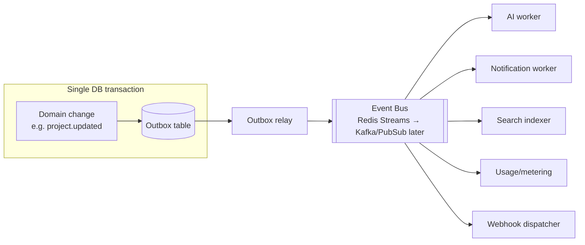

**Why outbox:** guarantees "state changed ⇒ event emitted" atomically, no lost events, no dual-write race. The relay polls the outbox and publishes; consumers are idempotent (dedupe on `event_id`).

### 8.2 Canonical events (v1)

| Event | Producer | Consumers |
|---|---|---|
| `org.created`, `member.invited`, `member.joined` | Identity | Notifications, Billing (seat count) |
| `client.created`, `project.created/updated` | Workspace | Search indexer, Notifications, AI (context refresh) |
| `github.workflow_completed` | Integrations | Notifications (WhatsApp alert), AI |
| `message.received` (WhatsApp/TG) | Messaging | AI orchestration |
| `ai.reply_generated` | AI | Messaging (deliver), Usage |
| `usage.recorded` | any | Billing/metering |
| `subscription.updated` | Billing | Identity (plan limits), Notifications |

**Bus choice, staged:** start on **Redis Streams** (already have Upstash — zero new infra) with consumer groups; graduate to **Kafka / Cloud Pub/Sub** when throughput or multi-consumer fan-out demands durability guarantees Redis can't cheaply give. The producer contract (outbox + event schema) does not change when the bus does.

Every event carries `org_id` — the async tier is tenant-aware end to end.

---

## 9. API Gateway strategy

Today clients hit Cloud Run directly and the app does authn, CORS, rate-limiting, security headers inline. We introduce an **edge gateway** to own cross-cutting concerns and to give us a stable public surface independent of internal topology.

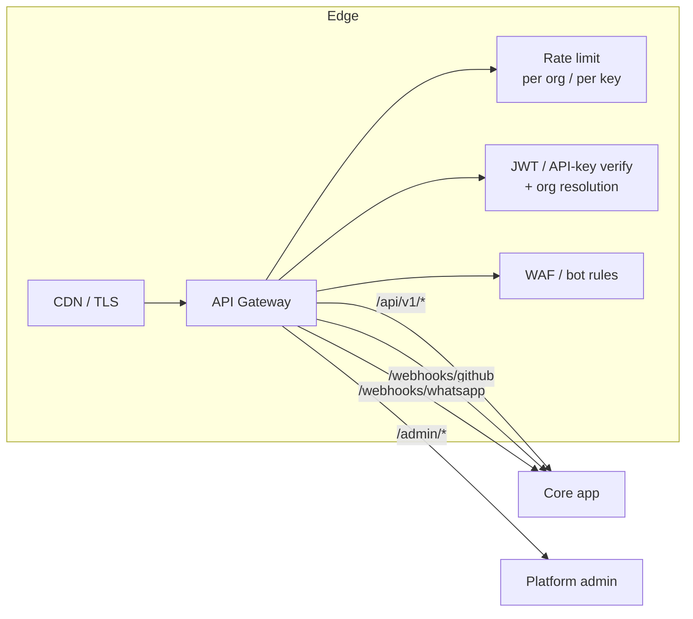

**Responsibilities:**
- TLS termination, CDN for static/edge caching.
- **Coarse authn** (validate JWT signature/exp, extract `org_id`) and reject early; the app still does fine-grained RBAC.
- **Tenant-aware rate limiting** keyed on `org_id` + plan tier (replaces the current global `slowapi` limits with per-org quotas — see §11 plan limits).
- Route segmentation: public API, webhooks (with their own signature verification preserved), admin plane.
- Versioning: `/api/v1` stays; gateway lets us run `v2` side by side during migrations.

**Pragmatic choice:** managed gateway (Google API Gateway / Cloud Load Balancing, or an ingress like Kong/Traefik) — not a bespoke service. Keep it thin; business logic never leaks into the edge. In the earliest phases this can be *logically* a middleware layer and only physically split out when we run multiple backend services.

---

## 10. Background worker architecture

Promote Celery from "thin" to a **first-class tier** with dedicated queues per workload class, so a slow AI call can't starve a fast notification.

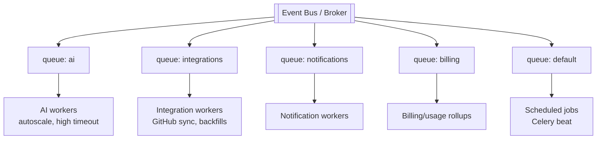

- **Queue classes** with independent concurrency & autoscaling: `ai` (long, expensive), `integrations` (GitHub, retriable), `notifications` (fast, high-volume), `billing` (usage rollups, invoice sync), `default`/beat (cron: cache warmups, log rotation, plan-limit resets).
- **Idempotency + retries with backoff + dead-letter queue** for poison messages.
- **Tenant fairness:** per-org concurrency caps so one org's bulk sync can't monopolize workers.
- **Scheduled work** (Celery beat / Cloud Scheduler): the CLAUDE log's "append every 5h" style jobs, usage resets, token/session cleanup, GitHub cache refresh.
- Workers run as a **separate Cloud Run service / job pool** from the API — scale and deploy independently (satisfies "each phase independently deployable").

---

## 11. Database strategy

### 11.1 Engine & topology
- **Postgres remains the system of record** (Supabase today; portable to Cloud SQL / RDS if we outgrow Supabase limits).
- **Connection pooling** via PgBouncer/pooler (already in use) — essential on Cloud Run where instances multiply.
- **Read replicas** for dashboards/reporting/search-backfill once read load justifies it; writes stay on primary.

### 11.2 Tenancy in the DB
- Shared schema + `org_id` on every tenant table (§3).
- **Row-Level Security** policies as the backstop; app sets `app.current_org` per transaction.
- **Composite indexes lead with `org_id`** (`(org_id, created_at)`, `(org_id, phone)`) — matches every query's access pattern and keeps tenants' data physically clustered.

### 11.3 Migrations
- **Alembic** stays. Enforce **expand→backfill→contract**; no destructive step in the same release that introduces the new shape.
- Backfills run as **batched, resumable jobs** (workers), not in the migration transaction — critical at thousands-of-orgs scale.

### 11.4 Isolation tiers (product-driven)
| Tier | Isolation | For |
|---|---|---|
| **Shared** (default) | Row-level (`org_id` + RLS) | The vast majority of orgs |
| **Dedicated schema** | Schema-per-tenant | Compliance-sensitive mid-market |
| **Dedicated DB** | Own database/instance | Large enterprise, data-residency |

`Organization.isolation_tier` selects routing; the tenant access layer abstracts *where* an org's data lives so app code is identical across tiers. We build **Shared** now; the abstraction leaves room for the others without refactoring callers.

---

## 12. Caching strategy

Layered, **tenant-namespaced**, with explicit invalidation. Today there's an ad-hoc `cache_service` plus a `github_cache` *table*; we formalize.

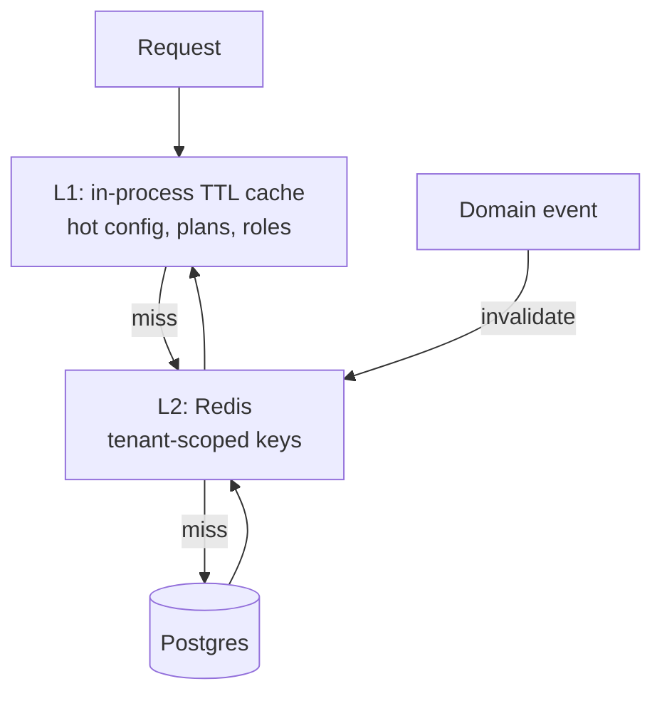

- **Key convention:** `org:{org_id}:{domain}:{entity}:{id}` — no key can be read cross-tenant.
- **What to cache:** plans/permissions (rarely change), session/JWT denylist, GitHub API responses (move `github_cache` table → Redis with TTL, keep DB only for durable sync state), dashboard aggregates, rate-limit counters.
- **Invalidation via events:** `project.updated` → drop `org:{}:project:{}`. Prefer event-driven busting over blind TTLs for correctness-sensitive data.
- **Rate-limit + quota counters** live in Redis keyed by org (feeds gateway limiting and plan enforcement).

---

## 13. Search strategy

Current search is SQL `LIKE`/filters — fine for a single agency's few clients, poor across large orgs and for message/chat history. Introduce a **dedicated search index**, fed by events.

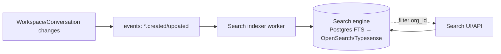

- **Start with Postgres full-text search** (`tsvector`, GIN indexes) — zero new infra, covers clients/projects/messages search within an org. Every query filtered by `org_id`.
- **Graduate to OpenSearch / Typesense / Meilisearch** when we need relevance ranking, typo tolerance, faceting, or cross-entity search at scale. The **event-fed indexer** means the source of truth (Postgres) and the read model (search) stay decoupled — swapping engines doesn't touch domain code.
- **Tenant safety:** `org_id` is a mandatory filter on every search; index documents carry it and queries inject it at the access layer.

---

## 14. File storage strategy

There is **no object storage today** (media URLs are fetched inline, e.g. Twilio media in `ai_agent.py` with SSRF guards). SaaS needs durable, tenant-isolated file storage for message attachments, exports, avatars, invoices.

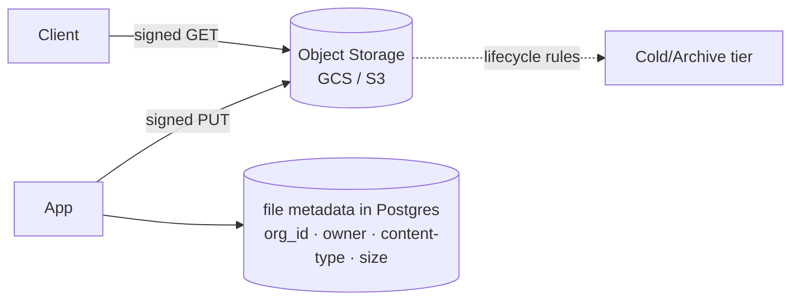

- **Object store** (GCS since we're on GCP; S3-compatible abstraction to stay portable).
- **Path convention:** `org/{org_id}/{domain}/{uuid}` — physical tenant prefixing.
- **Signed URLs** for upload/download (no proxying large blobs through the app); short TTLs.
- **Metadata row** per file (org-scoped) for listing, quota, and deletion.
- **Validation preserved:** content-type allowlist, size caps, virus-scan hook on the ingest event (extends the existing SSRF/size-cap discipline).
- **Twilio/GitHub inbound media** get copied into our own bucket by an integration worker rather than re-fetched from third-party CDNs.

---

## 15. AI service architecture

Preserve BYOK and multi-provider strengths; move heavy work off the request path; make provider selection and tooling first-class.

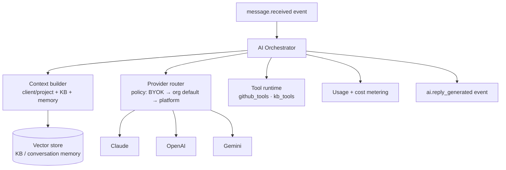

- **Orchestrator as an async worker** (queue `ai`), triggered by `message.received` — decouples slow LLM calls from webhook latency (the log already fixed one inline-call crash; this makes async the norm).
- **Provider abstraction stays** (`ai_providers/*`) but gains a **router with fallback + policy**: prefer org's BYOK key → org platform allocation → Voxly-managed key, with automatic failover (addresses the recurring "Anthropic 404" single-provider fragility).
- **Keys become `OrgAIKey`** (org-scoped, Fernet-encrypted, unchanged crypto) instead of per-user.
- **Vector store** (pgvector to start — already in the Postgres — then a dedicated vector DB if needed) for KB retrieval and per-org conversation memory. Strictly `org_id`-partitioned.
- **Tool runtime** stays provider-agnostic (the `to_openai_schema()` pattern) and every tool call is authorized against the org's permissions/integrations.
- **Cost & token metering** emitted as `usage.recorded` events → billing.

---

## 16. GitHub integration architecture

Harden and make tenant-correct. The log records the key bug class: webhooks notifying "the first random user with a phone" — a tenancy failure. Fix by binding installations to orgs.

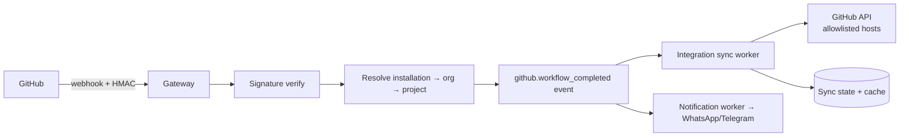

- **GitHub App / installation model** mapped to `org_id` (and `project.github_repo`) so a webhook resolves deterministically to the owning org — no "random user" lookups. Multi-tenant installs supported.
- **Webhook** keeps HMAC-SHA256 verification (already implemented) at the edge; on success emits an event and returns fast.
- **All fetching in workers** with the existing SSRF allowlist (api.github.com, pipelines host), 30s timeouts, and 50MB zip-bomb cap — preserved and centralized.
- **Sync state** durable in Postgres; volatile GitHub API responses cached in Redis (§12).
- **Retriable** via the `integrations` queue with backoff and DLQ.

---

## 17. WhatsApp integration architecture

Move from inline handling to event-driven; keep the strong security guards.

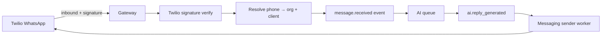

- **Inbound webhook** verifies Twilio signature (already implemented), redacts PII from logs (already done), resolves `phone → (org, client)` via the **org-scoped** phone index, emits `message.received`, returns 200 immediately.
- **No business logic in the webhook** — the earlier crash (calling an HTTP route from a background task, no Starlette `Request`) is designed out: handlers publish events, workers do the work.
- **Outbound** via a messaging sender worker; retriable, rate-limited per org.
- **Provider abstraction** (`messaging_core`) so WhatsApp/Telegram/future channels share inbound→event→reply→send. Production WhatsApp Business API onboarding is an infra step, not a code change.
- **Number ↔ org mapping** is explicit config per org (supports each org bringing its own WhatsApp sender at enterprise tier).

---

## 18. Notification architecture

Unify today's scattered notification paths (email via Resend, WhatsApp follow-ups, GitHub alerts) into one event-driven notification service with channel abstraction and user/org preferences.

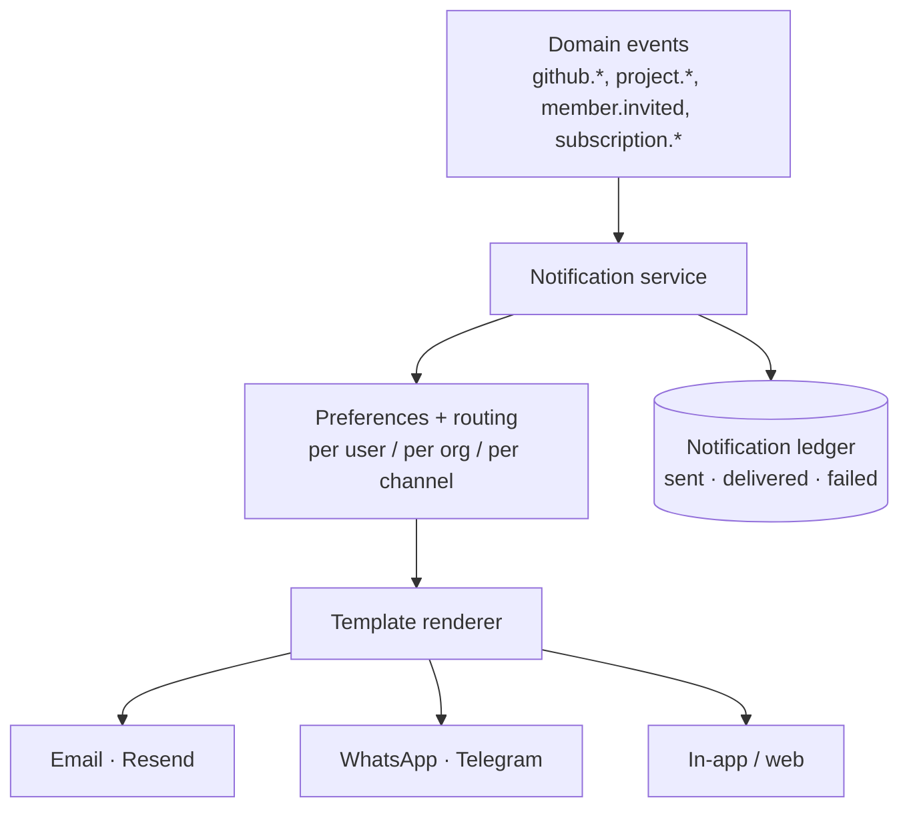

- **Event-triggered**, channel-agnostic; a notification is "render template + pick channels per preference."
- **Preferences** per user and per org (digest vs realtime, which channels).
- **Templates** versioned and localized; region-aware (India vs INTL).
- **Delivery ledger** for audit, retries, and dedupe (idempotent on event_id).
- **Productionizes password-reset email** (the long-standing open risk in the log): reset becomes a `member.password_reset_requested` event → email channel → one-use token, closing the "console-only" gap.

---

## 19. Billing architecture

Move billing from **per-user** to **per-org**, with seats + metered usage, keeping the Stripe/Razorpay region split.

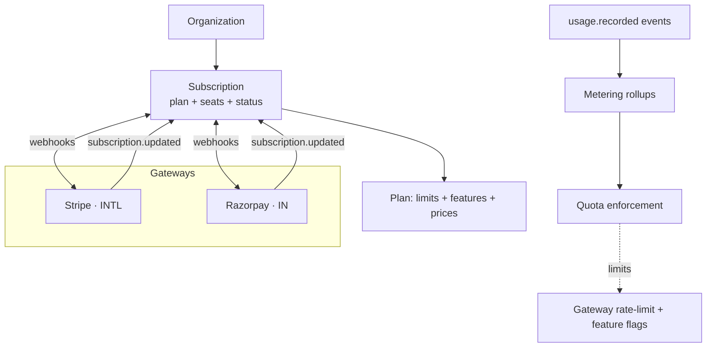

- **Subscription attaches to `Organization`** (not `User`). `billing_region` moves to the org and routes to Stripe (INTL) or Razorpay (IN) — the existing split preserved.
- **Plans gain seat limits** alongside the existing `max_clients/max_projects/rate_limit_*/max_ai_messages`. Seats = active memberships.
- **Metered usage**: `usage.recorded` events roll up per org per period; overages/quota enforced at the gateway and surfaced in-app. Replaces the per-request `usage_logs` grain with an event-sourced meter (old table becomes the raw feed).
- **Webhook-driven state**: gateway webhooks (verified) emit `subscription.updated` → identity updates plan limits → cache invalidated. Single source of truth for entitlements.
- **Dunning/trials/proration** handled via gateway + notification events.

---

## 20. Observability architecture

Today: Cloud Run logs + SonarCloud static analysis. Target: the three pillars, tenant-tagged, with SLOs.

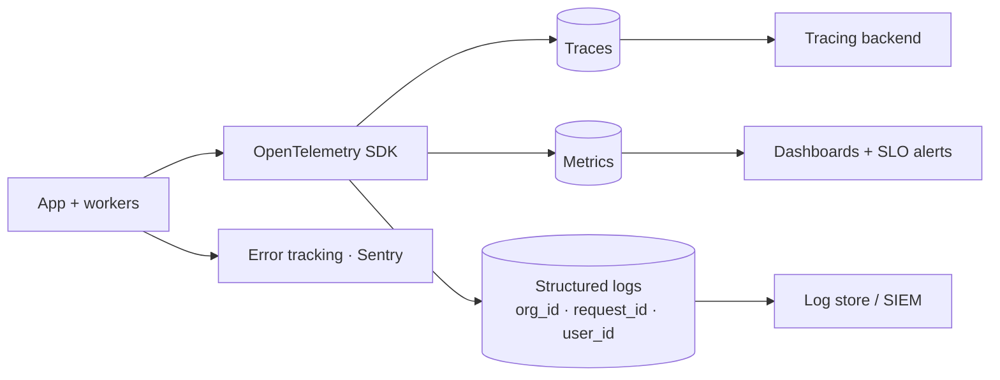

- **OpenTelemetry** everywhere; **every span/log carries `org_id`, `request_id`, `user_id`** — you can slice any incident by tenant.
- **Metrics & SLOs:** API latency/error rate per route, queue depth & worker lag, AI provider latency/cost, webhook success rate, per-org request volume. Alert on SLO burn, not raw thresholds.
- **Distributed tracing** across gateway → app → workers → external calls (LLM/GitHub) so async flows (webhook→event→AI→reply) are traceable end to end.
- **Error tracking** (Sentry) with tenant context.
- **Audit log** (security events, admin/super-admin actions, RBAC changes, data exports) as a distinct, tamper-evident stream.
- **Health/readiness** endpoints per service (extends today's `/health`) feeding deploy gates.

---

## 21. Security architecture

Preserve and systematize the substantial hardening already in the log (JWT iss/aud, Fernet BYOK, webhook HMAC, SSRF allowlists, rate limits, security headers, secret scanning).

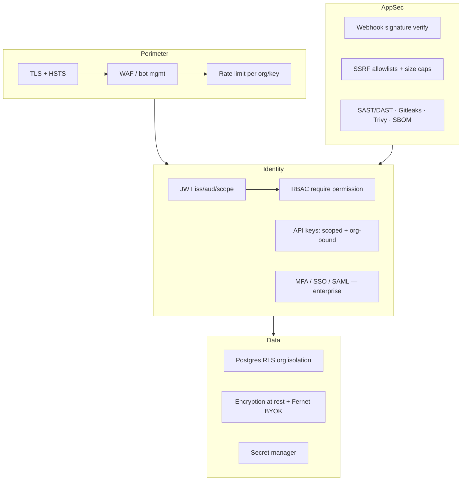

- **Tenant isolation is the #1 security control** — RLS + tenant access layer (§3). Add automated **cross-tenant tests** in CI (attempt to read another org's data → must 404/deny).
- **Identity:** JWT with iss/aud (present) + **token scopes/types** (the log's deferred item), refresh-token rotation, session denylist in Redis. **SSO/SAML + SCIM + MFA** for enterprise orgs.
- **Secrets:** move `.env`/`env.yaml` to a **secret manager** (GCP Secret Manager) — retires the "keep env.yaml in sync manually" risk in the log. BYOK Fernet keys unchanged.
- **API keys:** scoped, org-bound, hashed at rest, rotatable.
- **Webhook security:** HMAC/signature verification stays for GitHub, Twilio, Stripe/Razorpay — centralized at the edge.
- **Supply chain:** keep Gitleaks/Trivy/SBOM/SonarCloud; pin actions to SHA (already done); Dependabot.
- **Compliance runway:** audit logging, data-export/delete (GDPR — already have PRIVACY/TERMS), data-residency via isolation tiers (§11.4).

---

## 22. Deployment architecture

Multi-service, IaC-managed, staged environments — while keeping the "scale-to-zero, cheap" posture that works today.

```mermaid
flowchart TB
    subgraph CICD["CI/CD"]
        GHUB[GitHub] --> CI[Build · test · scan]
        CI --> ART[Artifact registry]
        ART --> STG[Deploy → Staging]
        STG --> SMOKE[Smoke + migration check]
        SMOKE --> PROD[Deploy → Prod<br/>canary/blue-green]
    end
    subgraph Prod["Production (GCP)"]
        LB[Load balancer / Gateway] --> API[Cloud Run: API]
        LB --> ADMIN[Cloud Run: Admin]
        WRK[Cloud Run: Workers]
        BEAT[Scheduler: cron]
        API --> PG[(Cloud SQL / Supabase)]
        WRK --> PG
        API --> RD[(Redis)]
        API --> OBJ[(Object storage)]
    end
```

- **Services deploy independently:** API, Workers, (later) Admin/Gateway are separate Cloud Run services with their own pipelines — satisfies "every phase independently deployable."
- **IaC** (Terraform) for all infra — retires manual `gcloud` steps in the log; reproducible envs.
- **Environments:** dev → staging → prod, with **migration gates** (Alembic run + verified before app cutover; the Dockerfile's "non-fatal alembic" hack is replaced by an explicit, gated migration job).
- **Progressive delivery:** canary/blue-green + **feature flags** so risky changes (tenant-model cutover!) roll out to a fraction of orgs first and roll back instantly.
- **Zero-downtime migrations** guaranteed by expand→contract + backward-compatible deploys.

---

## 23. Migration roadmap (incremental, each phase independently deployable)

**Overarching pattern:** strangler-fig + expand/contract. At every phase the product is live, existing customers are unaffected, and new customers can onboard. No phase requires the next.

```mermaid
flowchart LR
    P0[P0: Foundations] --> P1[P1: Org model<br/>+ backfill]
    P1 --> P2[P2: Tenant access layer<br/>+ RLS]
    P2 --> P3[P3: RBAC + teams]
    P3 --> P4[P4: Modular monolith<br/>boundaries]
    P4 --> P5[P5: Events + outbox<br/>+ worker tier]
    P5 --> P6[P6: Integrations async<br/>GitHub/WhatsApp/AI]
    P6 --> P7[P7: Billing per-org<br/>+ metering]
    P7 --> P8[P8: Search · storage · gateway]
    P8 --> P9[P9: Enterprise<br/>SSO · isolation tiers]
```

### Phase 0 — Foundations (no user-visible change)
- Terraform the existing infra; move secrets to Secret Manager (kills the `env.yaml` drift risk).
- Add OpenTelemetry + structured logging + Sentry (tenant tags land later).
- Stand up staging + migration-gated CI. Add import-linter scaffolding.
- **Deployable:** pure infra/observability; zero behavior change. ✅

### Phase 1 — Introduce the Organization (expand + backfill)
- Add `organizations`, `memberships`, `roles` tables. Add nullable `org_id` to tenant tables (`clients`, `subscriptions`, `api_keys`, `usage_logs`, `user_ai_keys`, `github_cache`).
- **Backfill worker:** create one personal org per existing user; set `Organization.owner_user_id`; create an `owner` membership; stamp `org_id` on all their rows. Move `agency_name`/`billing_region`/`subscription_tier` to the org (dual-read during transition).
- App still keys off `user_id`, but writes `org_id` too (dual-write). No UX change.
- **Deployable:** existing users transparently become single-member orgs. New signups get a personal org. ✅

### Phase 2 — Tenant access layer + RLS (cut isolation over)
- Build `platform/tenant.py`: request → active `org_id` → scoped session that injects `org_id` and `SET LOCAL app.current_org`.
- Add Postgres **RLS** policies (start in permissive/log mode, then enforce).
- Migrate routers off raw sessions to the scoped session, path by path, behind a flag. Add cross-tenant CI tests.
- Make `org_id` NOT NULL; switch reads from `user_id` to `org_id`; change `phone` unique index to `(org_id, phone)`.
- **Deployable:** isolation now enforced by construction; the "random user"/global-phone bug classes become structurally impossible. ✅

### Phase 3 — RBAC + teams (first new customer-facing capability)
- Ship roles/permissions and `require(permission)`; replace binary checks and the ad-hoc `super_admin` router with platform-role + org-role separation.
- Ship **invitations** UI/API → multi-user orgs, seats. This is the first true "team SaaS" feature and a sellable upgrade.
- **Deployable:** solo users unaffected (they're `owner` of a 1-seat org); teams become possible. ✅

### Phase 4 — Modular monolith boundaries (internal, safe)
- Reorganize `backend/app` into `platform/` + `modules/*` with `public.py` contracts; enforce with import-linter. No functional change, pure structure — sets up service extraction later.
- **Deployable:** same behavior, clean seams. ✅

### Phase 5 — Event backbone + worker tier
- Add outbox table + relay; stand up Redis Streams bus; formalize Celery queues (`ai`/`integrations`/`notifications`/`billing`/`default`) as a separate Worker service.
- Introduce first events (`project.*`, `member.*`) with idempotent consumers, running **alongside** existing sync paths (shadow mode).
- **Deployable:** events flow; nothing depends on them yet. ✅

### Phase 6 — Move integrations async (cut over the risky inline work)
- Route GitHub webhook → event → integration worker (bind installations to org, kill "random user"). WhatsApp/Telegram inbound → `message.received` → AI worker → `ai.reply_generated` → sender. AI orchestration moves to the `ai` queue with provider fallback.
- Remove inline handlers once shadow parity is proven.
- **Deployable:** latency drops, failures isolate, per-provider fragility (Anthropic 404) mitigated by fallback. ✅

### Phase 7 — Billing per-org + metering
- Move subscriptions to org grain; add seat limits; wire `usage.recorded` → metering rollups → quota enforcement at the gateway; verified Stripe/Razorpay webhooks → `subscription.updated`.
- Productionize password-reset + notification service (closes the long-standing email gap).
- **Deployable:** org-level plans, seats, and usage-based limits go live; region split preserved. ✅

### Phase 8 — Search, storage, gateway
- Postgres FTS search (org-filtered) → optional OpenSearch/Typesense via the event indexer. Object storage + signed URLs for attachments/exports. Physically split the edge gateway (managed) for tenant-aware rate limiting and clean versioning.
- **Deployable:** each is an independent, additive capability. ✅

### Phase 9 — Enterprise tier
- SSO/SAML + SCIM + MFA; dedicated-schema/DB isolation tiers via the tenant access-layer abstraction; audit-log export; data-residency options.
- **Deployable:** opt-in per org; shared-tier orgs unaffected. ✅

### Roadmap at a glance

| Phase | Theme | New customer value | Risk | Independently deployable |
|---|---|---|---|---|
| 0 | Foundations | — (reliability) | Low | ✅ |
| 1 | Org model + backfill | — (transparent) | Medium (backfill) | ✅ |
| 2 | Tenant layer + RLS | — (security) | Medium (cutover) | ✅ |
| 3 | RBAC + teams | **Teams & seats** | Low | ✅ |
| 4 | Modular monolith | — (velocity) | Low | ✅ |
| 5 | Events + workers | — (scale) | Low (shadow) | ✅ |
| 6 | Async integrations | Faster, reliable bots | Medium | ✅ |
| 7 | Billing per-org | **Plans, seats, metering** | Medium | ✅ |
| 8 | Search/storage/gateway | Search, files | Low | ✅ |
| 9 | Enterprise | **SSO, isolation, residency** | Medium | ✅ |

---

## Appendix A — The one migration that matters most

If you take nothing else: **Phases 1–2 (introduce `Organization`, move isolation into a single tenant-aware access layer + RLS)** are the linchpin. Everything downstream — teams, per-org billing, event fan-out, enterprise isolation — assumes an explicit tenant boundary. It is also the highest-risk change (touching every table and query), which is exactly why it is sequenced early, done with expand/backfill/contract, gated behind flags, and validated with automated cross-tenant tests before any feature work builds on it.

## Appendix B — What we deliberately are NOT doing
- **No microservices up front.** Modular monolith until scale/teams force extraction.
- **No big-bang rewrite.** Strangler-fig only.
- **No schema-per-tenant by default.** Shared schema + RLS; dedicated isolation is an enterprise opt-in.
- **No new datastore we don't yet need.** Postgres FTS before OpenSearch; pgvector before a dedicated vector DB; Redis Streams before Kafka. Introduce heavy infra only when the load proves it.
