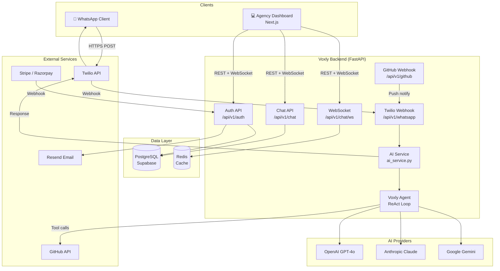
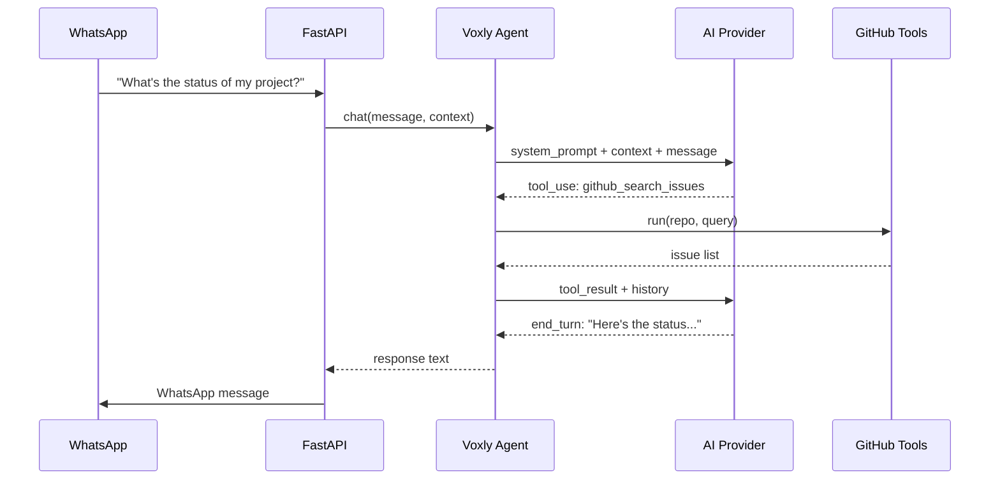

# Voxly — System Architecture

## High-Level Design (HLD)



---

## Component Breakdown

### 1. Frontend — Next.js 14 (App Router)

| Route | Purpose |
|-------|---------|
| `/` | Landing page |
| `/login`, `/register` | Auth |
| `/dashboard` | Main agency overview |
| `/clients` | Client management |
| `/projects` | Project tracker |
| `/messages` | Chat history viewer |
| `/chat` | Live AI chat interface with WebSocket |
| `/settings` | BYOK keys, billing, profile |
| `/forgot-password`, `/reset-password` | Password reset |

**Key Frontend Libraries:**
- Next.js 14 (App Router, Server Components)
- TypeScript
- Tailwind CSS
- Axios (HTTP client in `lib/api.ts`)
- Custom `useWebSocket` hook for real-time dashboard updates

---

### 2. Backend — FastAPI (Python 3.12)

#### API Routers (12 total)

| Prefix | Router File | Responsibility |
|--------|-------------|---------------|
| `/api/v1/auth` | `auth.py` | JWT auth, OAuth, password reset |
| `/api/v1/clients` | `clients.py` | CRUD for client accounts |
| `/api/v1/projects` | `projects.py` | CRUD for projects + GitHub link |
| `/api/v1/milestones` | `milestones.py` | Milestone tracking |
| `/api/v1/chat` | `chat.py` | Chat history + WebSocket |
| `/api/v1/whatsapp` | `whatsapp.py` | Twilio inbound webhook |
| `/api/v1/github` | `github.py` | GitHub push/CI webhooks |
| `/api/v1/billing` | `billing.py` | Stripe + Razorpay |
| `/api/v1/notifications` | `notifications.py` | Custom WhatsApp follow-ups |
| `/api/v1/dashboard` | `dashboard.py` | Aggregate stats for UI |
| `/api/v1/ai` | `ai.py` | Admin AI chat endpoint |
| `/api/v1/ai-keys` | `ai_keys.py` | BYOK key management |

#### Service Layer

| Service | File | Does |
|---------|------|------|
| AI Service | `ai_service.py` | Provider selection + response generation |
| Voxly Agent | `ai_agent.py` | ReAct loop with tool execution |
| Email | `email_service.py` | Resend integration |
| WhatsApp | `whatsapp_service.py` | Twilio send messages |
| GitHub | `github_service.py` | GitHub API calls |
| Notifications | `notification_service.py` | Custom message dispatch |
| Cache | `cache_service.py` | Redis-backed GitHub stats cache |

#### Security Middleware Stack (applied in order)
1. **CORS** — locked to `FRONTEND_URL`
2. **Security Headers** — `X-Content-Type-Options`, `X-Frame-Options`, `Referrer-Policy`, `HSTS` (HTTPS only)
3. **Rate Limiting** — `slowapi` per-route limits
4. **JWT Authentication** — `Depends(get_current_user)` on all protected routes
5. **Tenant Isolation** — all queries filter by `user_id`

---

### 3. AI Agent — ReAct Architecture



#### Available Tools
| Tool | Class | Does |
|------|-------|------|
| `github_search_issues` | `GitHubSearchIssuesTool` | Search open/closed issues |
| `github_get_file` | `GitHubGetFileTool` | Read files from repo |
| `github_create_issue` | `GitHubCreateIssueTool` | Create a new GitHub issue |
| `local_docs` | `LocalDocsTool` | Search local knowledge base |

---

### 4. Multi-Tenancy Model

Every agency owner is a **tenant**. Tenant isolation is enforced in every DB query:

```
User (tenant)
  └── Clients         (user_id FK)
        └── Projects  (client_id FK → user_id)
              └── Milestones
              └── Chat History
  └── API Keys
  └── Subscription
  └── Usage Logs
  └── AI Keys (BYOK)
```

- A user can **never** see another user's clients/projects/chats
- All cascade deletes are set: deleting a user removes all their data

---

### 5. Data Flow: WhatsApp Message → AI Reply

```
1.  Client sends WhatsApp to Twilio sandbox number
2.  Twilio POSTs to: POST /api/v1/whatsapp/webhook
3.  Backend verifies Twilio HMAC signature
4.  Extracts phone number, message body, media URL
5.  Looks up Client by phone → gets linked Project
6.  Calls generate_client_response(client, project, message)
7.  AI Service selects provider (Anthropic → Gemini → OpenAI)
8.  Voxly Agent runs ReAct loop (may call GitHub tools)
9.  Broadcasts result via WebSocket to agency dashboard
10. Saves to chat_history table
11. Sends reply via Twilio to client's WhatsApp
```

---

### 6. Infrastructure

| Component | Local Dev | Production (target) |
|-----------|-----------|---------------------|
| Database | Docker Postgres | Supabase (PostgreSQL) |
| Cache | Docker Redis | Railway Redis |
| Backend | `uvicorn --reload` | Railway / Fly.io |
| Frontend | `next dev` | Vercel |
| Webhooks | ngrok tunnel | Permanent railway URL |
| Email | Resend (sandbox) | Resend (production) |
| AI | OpenAI (dogfood) | Anthropic Claude (primary) |
