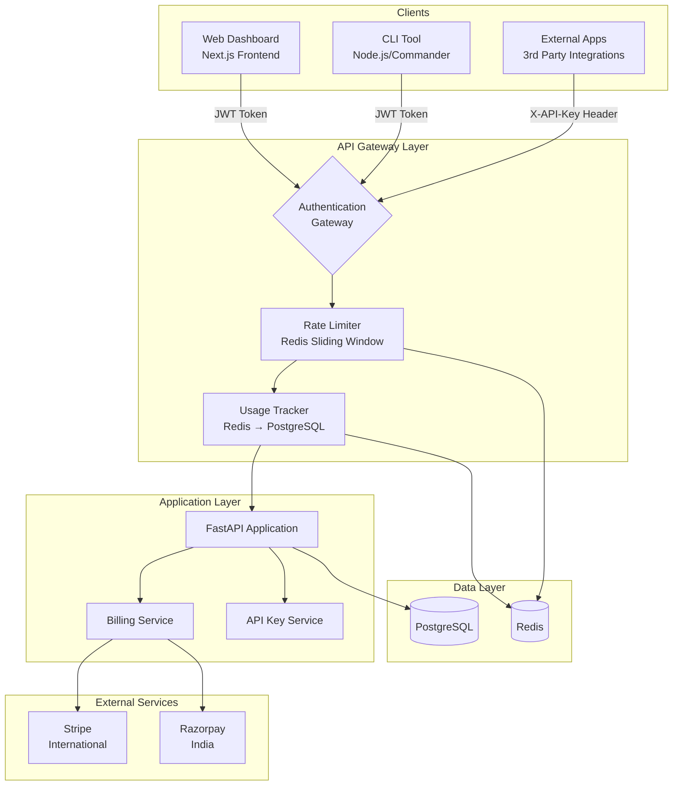
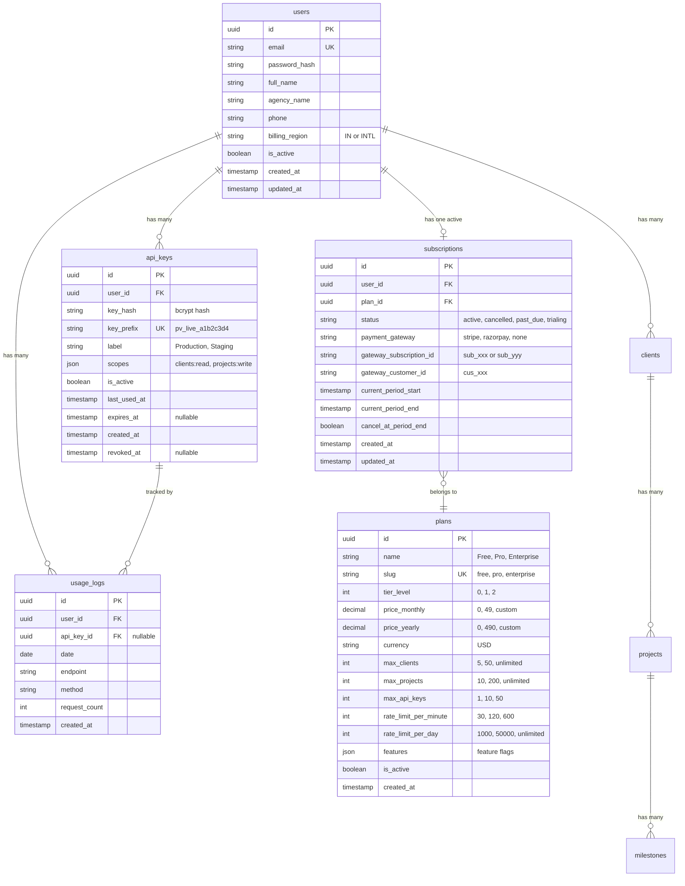
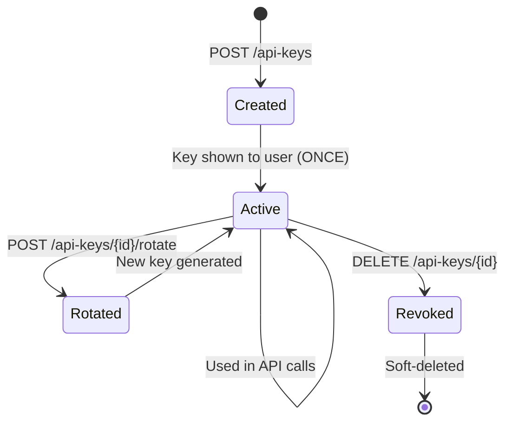
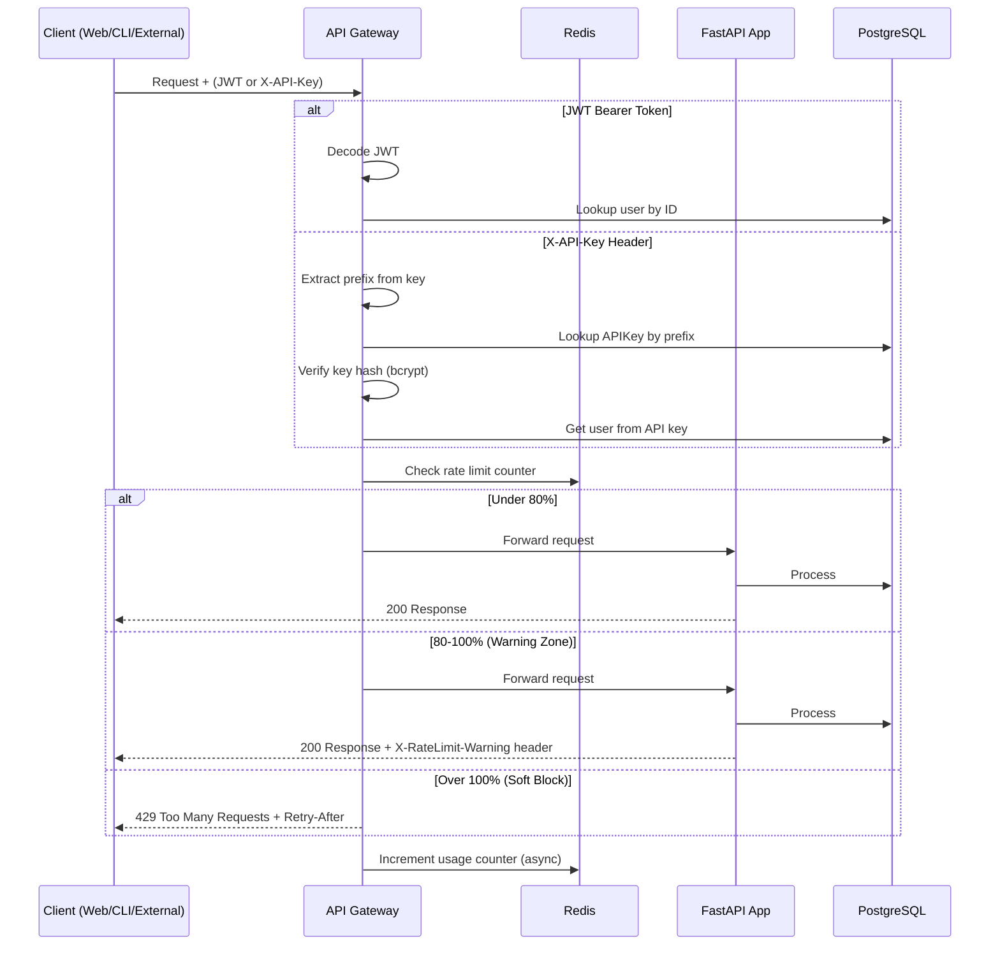
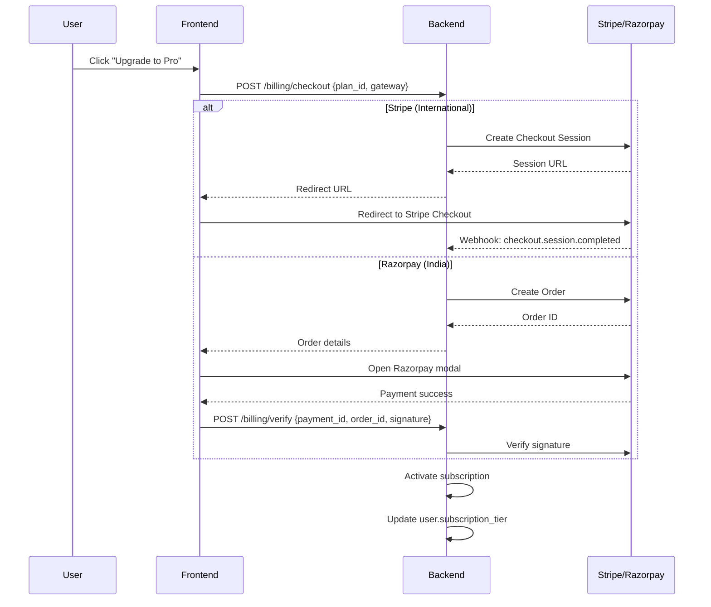
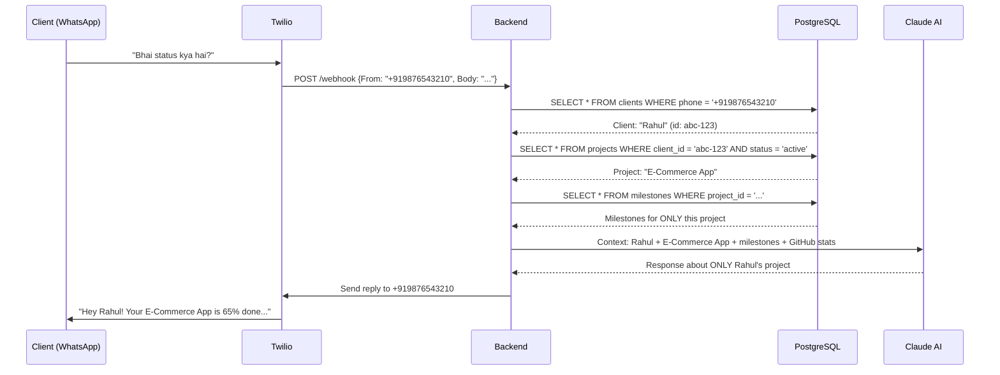
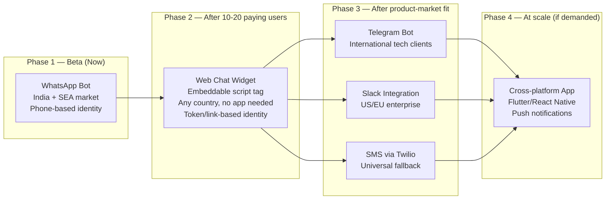
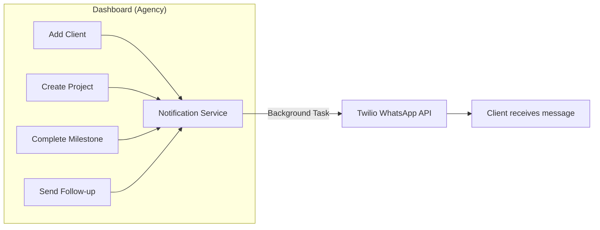

# ProjectVoice SaaS — System Design Document

## 1. Problem Statement

ProjectVoice is currently a single-user tool for agencies. We need to transform it into a **paid SaaS product** where:
- **Agencies** (5-50 clients) can manage multiple projects via dashboard + API
- **Solo tech founders** can integrate ProjectVoice into their workflows via API/CLI
- **Revenue** is generated through tiered subscriptions

---

## 2. User Personas & Flows

### Persona A: Agency (5-10+ clients)

```
Agency Owner (1 account)
├── Dashboard (Web UI) — manages clients, projects, milestones
├── API Keys
│   ├── 🔑 "Production" key → used in agency's internal tools / CRM integrations
│   ├── 🔑 "Staging" key → used for development & testing
│   └── 🔑 "WhatsApp Bot" key → used in their WhatsApp automation
├── Team (future scope) — invite team members
└── Billing — manages subscription, views usage
```

**How an agency with 5-10 clients manages API keys:**
- The agency has **ONE account** (the owner)
- All 5-10 clients live under that ONE account (as they do today)
- API keys belong to the **account level**, not client level
- The agency creates separate labeled keys for different **purposes** (not per-client)
- All keys access all clients under that account — scoping is by permission, not by client

> **Why not per-client keys?** Agencies manage clients holistically. They'd integrate ProjectVoice into their internal dashboard/CRM where one API key connects everything. Per-client keys add complexity without value for this use case.

### Persona B: Solo Tech Founder

```
Solo Founder (1 account)
├── Dashboard (optional) — quick overview
├── 🔑 1-2 API keys → integrated into their app/tool
├── CLI Tool → quick operations from terminal
└── Billing → manages subscription
```

---

## 3. High-Level Architecture



---

## 4. Database Design (ERD)



---

## 5. API Key Design

### Key Format
```
pv_live_a1b2c3d4e5f6g7h8i9j0k1l2m3n4o5p6
└──────┘ └──────────────────────────────────┘
 prefix          random 32-char hex
```

- **Prefix** (`pv_live_`): identifies the key type, visible in dashboard
- **Random part**: 32 chars of cryptographic randomness
- **Storage**: only the bcrypt hash stored in DB. The full key is shown **once** at creation

### Key Lifecycle


### Available Scopes
| Scope | Description |
|-------|-------------|
| `clients:read` | Read client data |
| `clients:write` | Create/update/delete clients |
| `projects:read` | Read project data |
| `projects:write` | Create/update/delete projects |
| `milestones:read` | Read milestone data |
| `milestones:write` | Create/update/delete milestones |
| `chat:read` | Read chat history |
| `chat:write` | Send messages via AI |
| `usage:read` | View usage statistics |

---

## 6. Authentication Flow



---

## 7. Rate Limiting Strategy (Soft Limits)

| Tier | Per Minute | Per Day | Warning At | Block At |
|------|-----------|---------|------------|----------|
| Free | 30 req | 1,000 req | 80% (24/min, 800/day) | 105% (grace) |
| Pro | 120 req | 50,000 req | 80% | 105% |
| Enterprise | 600 req | Unlimited | 80% | N/A |

### Response Headers (on every API response)
```http
X-RateLimit-Limit: 120
X-RateLimit-Remaining: 45
X-RateLimit-Reset: 1707600000
X-RateLimit-Warning: "Approaching rate limit (80%+ used)"  # only when ≥80%
```

### What happens at each threshold:
1. **0-79%**: Normal operation, headers included
2. **80-99%**: `X-RateLimit-Warning` header added, email notification sent (once per day)
3. **100-105%**: Grace buffer — requests still processed with urgent warning
4. **105%+**: Hard block → `429 Too Many Requests` with `Retry-After` header

---

## 8. Billing Architecture



### Gateway Selection Logic
```
if user.billing_region == "IN":
    show Razorpay (INR pricing)
else:
    show Stripe (USD pricing)

# User can manually switch via Settings
```

---

## 9. Plan Limits Matrix

| Feature | Free | Pro ($49/mo) | Enterprise (Custom) |
|---------|------|-------------|---------------------|
| Clients | 5 | 50 | Unlimited |
| Projects | 10 | 200 | Unlimited |
| API Keys | 1 | 10 | 50 |
| Rate Limit/min | 30 | 120 | 600 |
| Rate Limit/day | 1,000 | 50,000 | Unlimited |
| WhatsApp Bot | ❌ | ✅ | ✅ |
| GitHub Sync | Basic | Full | Full + Priority |
| AI Chat | 50 msg/day | 1,000 msg/day | Unlimited |
| Support | Community | Email | Dedicated |

---

## 10. CLI Design (for Developers)

The CLI is a lightweight tool for developers who prefer terminal workflows.

### Installation
```bash
npm install -g @projectvoice/cli
# or
npx @projectvoice/cli
```

### Commands & Flows
```
$ pv login
✉ Email: dev@agency.com
🔑 Password: ********
✅ Logged in as "TechAgency" (Pro plan)
   Token saved to ~/.projectvoice/config.json

$ pv keys list
┌──────────────────┬─────────────┬──────────┬─────────────────┐
│ ID               │ Label       │ Status   │ Last Used       │
├──────────────────┼─────────────┼──────────┼─────────────────┤
│ pv_live_a1b2...  │ Production  │ ✅ Active │ 2 minutes ago   │
│ pv_live_x9y8...  │ Staging     │ ✅ Active │ 3 days ago      │
│ pv_live_m5n6...  │ Old Key     │ 🔴 Revoked│ 30 days ago     │
└──────────────────┴─────────────┴──────────┴─────────────────┘

$ pv keys create --label "CI/CD Pipeline"
✅ API Key created!
🔑 Key: pv_live_q7w8e9r0t1y2u3i4o5p6a7s8d9f0g1h2
⚠️  Save this key! It won't be shown again.

$ pv usage
📊 Usage (Feb 2026)
   Plan: Pro ($49/mo)
   API Calls: 12,430 / 50,000 (24.9%)
   Clients: 8 / 50
   Projects: 23 / 200
   API Keys: 3 / 10
   ████░░░░░░ 24.9% of daily limit

$ pv clients list
┌──────────────┬───────────────┬──────────┬──────────┐
│ Name         │ Company       │ Projects │ Status   │
├──────────────┼───────────────┼──────────┼──────────┤
│ John Doe     │ Acme Corp     │ 3        │ Active   │
│ Jane Smith   │ StartupXYZ    │ 2        │ Active   │
└──────────────┴───────────────┴──────────┴──────────┘

$ pv plan
📋 Current Plan: Pro
   Price: $49/month
   Renews: March 11, 2026
   Gateway: Stripe
   Status: ✅ Active
```

### Config Storage
```
~/.projectvoice/
├── config.json    # JWT token, API URL, preferences
└── .pv_history    # Command history (optional)
```

---

## 11. Agency Scenario Walkthrough

### "DigitalCraft Agency" — 8 Clients, 15 Projects

```mermaid
graph TD
    subgraph "DigitalCraft Agency Account (Pro Plan)"
        OWNER[Agency Owner<br/>dev@digitalcraft.com]
        
        subgraph "API Keys (3 of 10 used)"
            K1["🔑 Production<br/>pv_live_a1b2...<br/>Used by: Internal Dashboard"]
            K2["🔑 Staging<br/>pv_live_x9y8...<br/>Used by: Dev Environment"]
            K3["🔑 WhatsApp Bot<br/>pv_live_m5n6...<br/>Used by: Client Notifications"]
        end

        subgraph "Clients (8 of 50 used)"
            C1[Client: Acme Corp<br/>3 projects]
            C2[Client: StartupXYZ<br/>2 projects]
            C3[Client: RetailCo<br/>2 projects]
            C4[..."5 more clients"]
        end
    end

    K1 -->|Full access| C1
    K1 -->|Full access| C2
    K1 -->|Full access| C3
    K1 -->|Full access| C4
    K2 -->|Full access| C1
    K3 -->|chat:write only| C1
    K3 -->|chat:write only| C2
```

### How It Works Day-to-Day:
1. **Morning**: Agency owner opens dashboard, reviews all 8 clients' project statuses
2. **During work**: Their internal CRM uses the "Production" API key to sync client data
3. **Automated**: WhatsApp bot uses a scoped key to send milestone updates to clients
4. **Developer**: Uses CLI to quickly check usage → `pv usage`
5. **Billing**: One invoice, one subscription — covers all 8 clients

### Key Insight:
> The API key grants access to **all resources under the account**. The key's `scopes` control **what actions** (read/write) are allowed, not **which clients**. This is intentional — agencies need holistic access, and per-client key isolation would create unnecessary overhead.

---

## 12. Security Considerations

| Concern | Mitigation |
|---------|-----------|
| API key leak | Keys are hashed (bcrypt) in DB; prefix-based lookup; instant revocation |
| Brute force | Rate limiting on auth endpoints; key validation is O(1) via prefix index |
| Replay attacks | TLS enforced; optional key expiration |
| Privilege escalation | Scope-based access control on API keys |
| Billing fraud | Webhook signature verification (Stripe/Razorpay); idempotent handlers |
| Data isolation | All queries scoped to `user_id`; multi-tenant by design |

---

## 13. Implementation Order

```mermaid
gantt
    title Implementation Phases
    dateFormat  X
    axisFormat %s

    section Phase 1: Foundation
    DB Models & Migrations       :a1, 0, 2
    Schemas & Config             :a2, 0, 1

    section Phase 2: Core Engine
    API Key Auth Middleware       :b1, 2, 2
    Rate Limiter (Redis)         :b2, 2, 2
    Usage Tracker                :b3, 3, 1

    section Phase 3: API Routes
    API Key CRUD Routes          :c1, 4, 2
    Billing Routes               :c2, 4, 2

    section Phase 4: Billing
    Stripe Integration           :d1, 6, 2
    Razorpay Integration         :d2, 7, 2

    section Phase 5: Frontend
    API Keys Settings Tab        :e1, 6, 2
    Billing Settings Tab         :e2, 7, 2

    section Phase 6: CLI
    CLI Scaffold + Login         :f1, 8, 1
    CLI Key + Usage Commands     :f2, 9, 1

    section Phase 7: Testing
    Integration Tests            :g1, 9, 2
    Security Audit               :g2, 10, 1
```



---

## 14. Client Data Isolation Guarantee (AI Agent / WhatsApp Bot)

> [!IMPORTANT]
> This section addresses the critical question: *"If an agency has 10-15 clients, how does the AI agent know which client it's talking to, and how do we guarantee it never exposes one client's data to another?"*

### How the AI Agent Identifies Clients



### Three Layers of Isolation

| Layer | How It Works | Code Reference |
|-------|-------------|----------------|
| **Layer 1: Phone = Identity** | Each client has a unique phone number. WhatsApp message `From` field identifies them. No login needed. | `chat.py` line 51: `Client.phone == phone` |
| **Layer 2: Query Scoping** | All DB queries are filtered by `client_id`. Client A's query never touches Client B's rows. | `chat.py` line 65: `Project.client_id == client.id` |
| **Layer 3: AI Context Isolation** | Claude receives ONLY the identified client's name, project, milestones, and GitHub stats. No other client data is in the prompt. | `ai_service.py` line 40-58: context built from single client |

### Example: 10 Clients, Zero Data Leaks

```
Agency "CodeAndCount" — 10 Clients on WhatsApp

Client 1: Rahul  (+91-98765-43210) → Asks "status?" → Gets ONLY "E-Commerce App" data
Client 2: Priya  (+91-98765-43211) → Asks "status?" → Gets ONLY "SaaS Dashboard" data
Client 3: Amit   (+91-98765-43212) → Asks "delay?" → Gets ONLY "Mobile App" data
...
Client 10: Sneha (+91-98765-43219) → Asks "kab hoga?" → Gets ONLY "Portfolio Site" data

❌ Rahul can NEVER see Priya's project data
❌ Amit can NEVER see Sneha's milestones
✅ Each client is sandboxed by their phone number
```

### What If a Client Has Multiple Projects?

Currently the system picks the **first active project**. For agencies with clients having 2+ projects, the bot can be enhanced to:
1. List active projects: *"You have 2 active projects: E-Commerce App & Admin Panel. Which one?"*
2. Let client reply with project name
3. Scope the response to that specific project

### Time Saved

| Task | Manual (per client) | Automated (AI Bot) |
|------|--------------------|--------------------|
| Status update call | 20-30 min | 5 seconds |
| Follow-up questions | 10-15 min | Instant |
| Weekly check-in | 15-20 min | Automated |
| **Total per client/week** | **~1 hour** | **~0 minutes** |
| **10 clients × 4 weeks** | **40 hours/month** | **Automated** |

> **Bottom line:** The AI agent uses phone-number-based identity (already built and bulletproof). Even as a SaaS with 100+ agencies each managing 10-15 clients, every client conversation is completely isolated — the AI never sees data it shouldn't.

---

## 15. Multi-Channel Communication Roadmap

> [!NOTE]
> WhatsApp is the launch channel. The architecture is designed to be **channel-agnostic** — adding new channels requires only a new webhook endpoint + identity mapping. The core AI logic is reused across all channels.

### Channel Comparison

| Channel | Best Market | Identity Method | Effort | Priority |
|---------|------------|----------------|--------|----------|
| **WhatsApp** (Twilio) | India, SEA, LATAM | Phone number | ✅ Built | **Beta Launch** |
| **Web Chat Widget** | Universal | Token/link from agency | Medium | **Phase 2** |
| **Telegram Bot** | International devs, tech community | Telegram user ID | Easy | Phase 3 |
| **Slack Integration** | US/EU enterprise agencies | Slack user ID | Medium | Phase 3 |
| **SMS** (Twilio) | US/UK fallback | Phone number | Easy | Phase 3 |
| **Cross-platform App** | Premium offering | App login | High | Phase 4 (if needed) |

### Phased Rollout



### Why This Works — Channel-Agnostic Architecture

The current backend cleanly separates **channel** from **logic**:

```
Any Channel → Extract Identity → handle_chat() → AI Service → Response
```

To add a new channel, only 2 things are needed:
1. **New webhook/endpoint** (e.g., `/api/v1/telegram/webhook`)
2. **Identity mapping** (Telegram user ID → client record in DB)

The `handle_chat()` function and `generate_client_response()` AI service remain **completely untouched** — they just need a client name, project data, and a question.

### Web Chat Widget (Phase 2) — How It Works

```
Agency sends client a unique link:
  https://chat.projectvoice.app/c/abc123token

Client opens link → Widget loads → Sends message
  ↓
Backend: Token "abc123token" → Client ID → Same chat flow
  ↓
AI responds with project status (same as WhatsApp)
```

- No app download required
- Works on any device, any country
- Agency can embed `<script src="projectvoice-widget.js">` on their own website

### International Client Support

| Region | Recommended Channel | Why |
|--------|-------------------|-----|
| India | WhatsApp | 97% smartphone users have WhatsApp |
| US/Canada | Web Widget + Slack | Business-first; WhatsApp less common for B2B |
| Europe | Web Widget + Telegram | GDPR-friendly; Telegram popular in Eastern Europe |
| Southeast Asia | WhatsApp | Similar adoption to India |
| Latin America | WhatsApp | Dominant messaging platform |

> **Beta strategy:** Launch with WhatsApp for India-based agencies. Add Web Chat Widget when the first international customer asks for it — it's the universal channel that works everywhere.

---

## 16. Event-Driven Outbound Notifications

> [!NOTE]
> The AI chatbot (inbound) is already built. This section covers **outbound** — automatic WhatsApp messages triggered by dashboard actions.

### How It Works



### Notification Events

| Event | Trigger | Message |
|-------|---------|---------|
| **Welcome** | Client added in dashboard | "👋 Hi {name}! You've been added to {agency}'s project tracker. Text me anytime for updates!" |
| **Project Started** | Project created for client | "🚀 Your project '{name}' has kicked off! Ask me anytime for status." |
| **Milestone Done** | Milestone marked complete | "✅ '{milestone}' is done! Overall: {progress}% complete." |
| **Project Done** | Project status → completed | "🎉 Your project '{name}' is complete! Thank you!" |
| **Manual Follow-up** | Agency sends custom message | Custom text typed in dashboard |

### Agency Controls

- Toggle each notification type on/off per account
- Preview message before sending (manual follow-ups)
- View notification history per client
