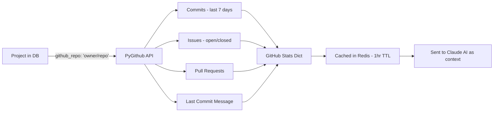
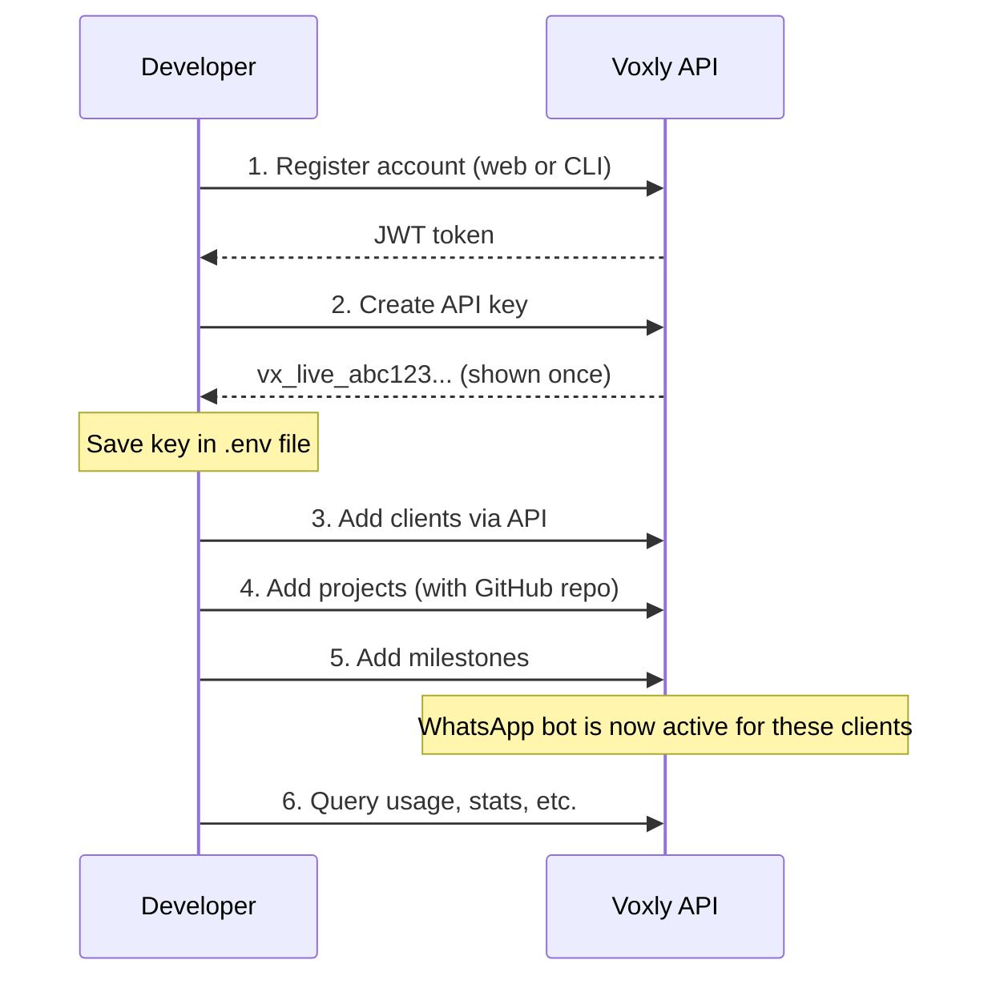
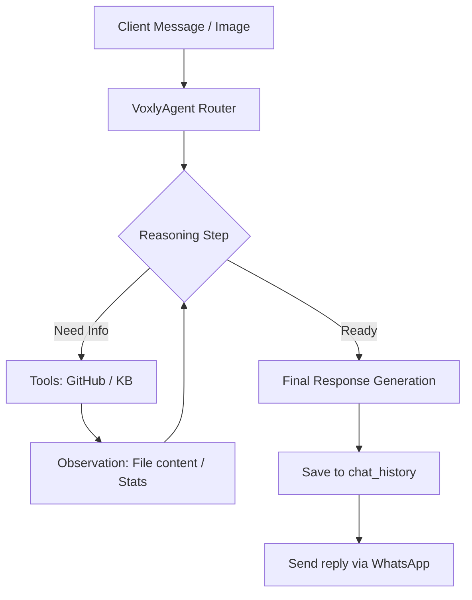
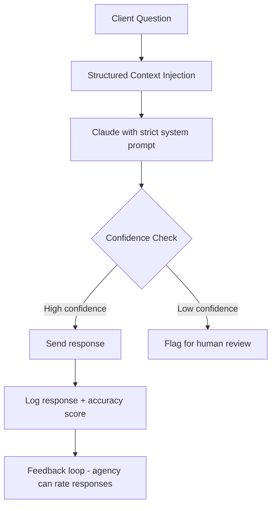
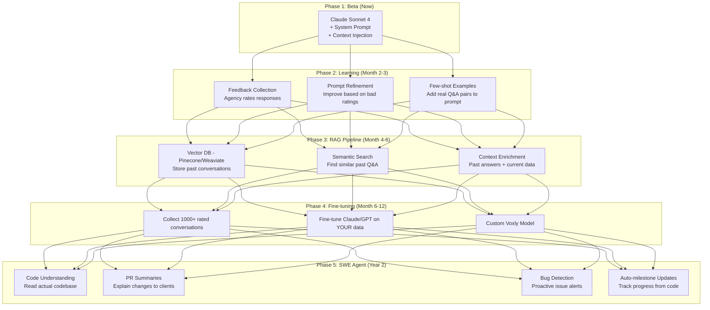

# Voxly — Technical Deep Dive & Beta Roadmap

## Question 1: How Does GitHub Codebase Access Work?

### What's Already Built

Your system accesses GitHub repos via the **PyGithub** library using a Personal Access Token:



**Current data the AI gets from GitHub:**
| Data Point | How It's Fetched | Used For |
|---|---|---|
| Commits (7 days) | `repo.get_commits(since=7_days_ago)` | Activity level |
| Open issues | `repo.open_issues_count` | Work remaining |
| Closed issues | `total - open` | Work completed |
| Progress % | `closed_issues / total_issues × 100` | Overall progress |
| Last commit message | Latest commit's first line | Recent work |
| Pull requests | `repo.get_pulls(state='all')` | Code review activity |

### Can the AI Read Actual Code and Act?

**Yes.** Voxly has graduated to an **Agentic System**. It doesn't just read stats; it can "browse" your repository to find answers and even perform actions.

| Level | Capability | Status | Accuracy Boost |
|---|---|---|---|
| **Level 1** | Stats only (commits, issues) | ✅ Built | Basic |
| **Level 2** | + Semantic Search in KB | ✅ Built | +20% |
| **Level 3** | + Vision (Analyzing screenshots) | ✅ Built | +40% |
| **Level 4** | + **Directory Browsing & File Reading** | ✅ Built | +60% |
| **Level 5** | + **Autonomous GitHub Issue Creation** | ✅ Built | +80% |

**Voxly is now a Level 5 AI Agent.** If a client sends a screenshot of a bug, the AI analyzes the image, checks the codebase to understand the context, and automatically opens a GitHub issue for your developers.

### How GitHub Access Works for a SaaS User

```
Agency signs up → Adds a project → Enters "owner/repo" → Provides GitHub token
                                                            ↓
Backend stores token (encrypted) → Uses it to fetch repo stats periodically
```

> [!IMPORTANT]
> Each agency provides their OWN GitHub token (scoped to their repos). Your platform's token is never used for customer repos. This is critical for security and permissions.

---

## Question 2: How Does a Developer Integrate This?

### Integration Flow



### Code Examples

**Using curl:**
```bash
# Create a client
curl -X POST https://api.voxly.dev/api/v1/clients \
  -H "X-API-Key: vx_live_abc123..." \
  -H "Content-Type: application/json" \
  -d '{"name": "Rahul", "phone": "+919876543210", "company": "Acme Corp"}'

# Add a project with GitHub repo
curl -X POST https://api.voxly.dev/api/v1/projects \
  -H "X-API-Key: vx_live_abc123..." \
  -d '{"client_id": "uuid-here", "name": "E-Commerce App", "github_repo": "agency/ecommerce"}'
```

**Using Python:**
```python
import requests

API_KEY = "vx_live_abc123..."
BASE = "https://api.voxly.dev/api/v1"
headers = {"X-API-Key": API_KEY}

# List all clients
clients = requests.get(f"{BASE}/clients", headers=headers).json()

# Check usage
usage = requests.get(f"{BASE}/billing/usage", headers=headers).json()
print(f"API Calls: {usage['used']}/{usage['limit']}")
```

**Using JavaScript:**
```javascript
const VX_KEY = "vx_live_abc123...";

const response = await fetch("https://api.voxly.dev/api/v1/clients", {
  headers: { "X-API-Key": VX_KEY }
});
const clients = await response.json();
```

---

## Question 3: How Will the AI Chatbot Work?

### Current Architecture

### The Agentic Loop (ReAct)

Voxly uses a **ReAct (Reason + Act)** pattern. It doesn't just guess; it "thinks" through the problem.



### Multimodal Vision Support

If a client sends an image:
1. **Twilio Webhook** detects `MediaUrl0`.
2. **Vision Engine** (GPT-4o / Gemini 1.5) analyzes the visual pixels.
3. **Agent Loop** correlates the visual bug (e.g., "The button is off") with the code tools.
4. **Autonomous Action**: The agent can call `create_github_issue` with the image embedded.

```
Claude receives:
┌─────────────────────────────────────────────┐
│ SYSTEM PROMPT: "You are a friendly PM..."   │  ← Personality & rules
│                                             │
│ CONTEXT:                                    │
│   Client: Rahul                             │  ← Who's asking
│   Project: E-Commerce App                   │  ← Their project
│   Commits (7 days): 15                      │  ← Real GitHub data
│   Open Issues: 3                            │  ← Real work status
│   Milestones:                               │
│     ✅ Homepage: 100%                       │  ← Real milestone data
│     🔄 Payment: 75%                         │
│     ⏳ Admin: 0%                            │
│                                             │
│ QUESTION: "Bhai status kya hai?"            │  ← Client's message
└─────────────────────────────────────────────┘

Claude outputs: A natural, accurate response using ONLY the above data
```

**Key principle:** The AI **cannot hallucinate project data** because it only uses structured data you give it. It doesn't search the internet or make up facts — it translates your DB data into human-friendly language.

---

## Question 4: How Do We Achieve ~100% Accuracy?

### The Accuracy Problem

| Type | Risk | Solution |
|---|---|---|
| **Wrong project data** | AI says 80% but it's 60% | Impossible — AI reads from DB directly |
| **Wrong client data** | Leaks Client B's info to A | Impossible — phone-scoped queries |
| **Hallucinated dates** | AI invents a deadline | Fix: inject dates in context, instruct "ONLY use provided dates" |
| **Vague answers** | "Things are going well" | Fix: force structured response format |
| **Stale data** | GitHub stats are 2 hours old | Fix: reduce cache TTL, add "last synced" disclaimer |

### Strategy: RAG + Structured Data + Guardrails



### 5 Layers of Accuracy

**Layer 1: Structured Data (No hallucination possible)**
- Milestones, progress %, dates → come directly from your DB
- AI translates, never invents

**Layer 2: Strict System Prompt**
```
"NEVER invent information. If data is missing, say 'I don't have that info, 
let me connect you with your PM.' ONLY use the data provided in the context."
```

**Layer 3: Confidence Scoring**
- After response, check if AI mentioned data not in the context
- If yes → flag for human review before sending

**Layer 4: Response Templates**
- For common questions (status, timeline, delay), use semi-structured templates
- AI fills in the blanks from real data

**Layer 5: Feedback Loop**
- Agency can rate AI responses (thumbs up/down)
- Bad responses get logged → improve system prompt
- Over time, prompt gets battle-tested

> **Reality check:** 100% accuracy on *factual project data* is achievable because the AI reads from a database, not from its imagination. The remaining risk is *tone/interpretation*, which improves with prompt refinement.

---

## Question 5: How to Train & Improve the AI Over Time?

### Evolution Roadmap



### Phase-by-Phase Detail

| Phase | What | How | When |
|---|---|---|---|
| **1. Prompt Engineering** | Better system prompt | Add few-shot examples from real conversations | Beta |
| **2. Feedback Loop** | Agency rates responses | 👍/👎 buttons → bad ones get reviewed | Month 1-2 |
| **3. Conversation Memory** | AI remembers past chats | Load last 5 messages as context | Month 2 |
| **4. RAG Pipeline** | Similar past Q&A retrieval | Embed conversations in vector DB, retrieve similar ones | Month 4 |
| **5. Fine-tuning** | Custom model | Train on 1000+ rated conversations | Month 6+ |
| **6. SWE Agent** | Code-aware AI | Read PRs, diffs, code structure | Year 2 |

### From PM Bot → SWE Agent (Long-term Vision)

```
TODAY: "What's my project status?"
  → AI reads milestones + GitHub stats → Gives summary

MONTH 6: "What was worked on this week?"
  → AI reads commit messages + PR descriptions → Gives detailed summary

YEAR 2: "Are there any potential bugs in the payment module?"
  → AI reads actual code + test coverage → Flags potential issues
  → AI suggests fixes → Developer reviews
```

---

## Beta Launch Roadmap — 4 Weeks to Ship 🚀

### Week 1: Core Backend (API Keys + Auth)

| Day | Task | Hours |
|-----|------|-------|
| Mon | DB models (Plan, Subscription, APIKey, UsageLog) + Alembic migration | 4h |
| Mon | Seed default plans (Free/Pro/Enterprise) | 1h |
| Tue | API Key generation, hashing, validation logic | 4h |
| Tue | Dual-auth middleware (JWT + API Key) | 2h |
| Wed | API Key CRUD routes (create/list/revoke/rotate) | 4h |
| Wed | Redis rate limiter (soft limits) | 3h |
| Thu | Usage tracking (Redis counters → flush to DB) | 3h |
| Thu | Billing routes scaffolding (plans list, usage stats) | 2h |
| Fri | Integration testing + bug fixes | 4h |

### Week 2: Billing + Frontend

| Day | Task | Hours |
|-----|------|-------|
| Mon | Stripe integration (checkout, webhooks, portal) | 5h |
| Tue | Razorpay integration (orders, verification, webhooks) | 5h |
| Wed | Frontend: API Keys tab in Settings | 5h |
| Thu | Frontend: Billing tab in Settings (plan display, upgrade) | 5h |
| Fri | Frontend: Usage stats dashboard | 4h |

### Week 3: CLI + Polish

| Day | Task | Hours |
|-----|------|-------|
| Mon | CLI scaffold (Commander.js, login command) | 3h |
| Tue | CLI keys commands (list, create, revoke) | 3h |
| Tue | CLI usage + plan commands | 2h |
| Wed | AI accuracy improvements (better system prompt, confidence scoring) | 4h |
| Thu | Error handling, edge cases, logging | 4h |
| Fri | Documentation (API docs, integration guide) | 4h |

### Week 4: Testing & Launch

| Day | Task | Hours |
|-----|------|-------|
| Mon | End-to-end testing (API keys, billing, CLI) | 5h |
| Tue | Security audit (key hashing, webhook verification, data isolation) | 4h |
| Wed | Stripe/Razorpay test mode full checkout flow | 4h |
| Thu | Self-test: use it as your own agency with real clients | 5h |
| Fri | **BETA LAUNCH** 🚀 | - |

### What Beta Includes (MVP)

| Feature | In Beta? | Notes |
|---------|----------|-------|
| API Key generation & management | ✅ | Full CRUD + rotate |
| Dashboard (API Keys + Billing tabs) | ✅ | In Settings page |
| WhatsApp AI Bot | ✅ | Already built |
| Soft rate limiting | ✅ | Warnings + headers |
| Stripe billing (international) | ✅ | Test mode first |
| Razorpay billing (India) | ✅ | Test mode first |
| CLI tool | ✅ | Basic commands |
| Free + Pro plans | ✅ | Enterprise = manual |
| AI accuracy improvements | ✅ | Better prompt + guardrails |
| Web Chat Widget | ❌ | Phase 2 (post-beta) |
| Telegram/Slack | ❌ | Phase 3 |
| Fine-tuned AI model | ❌ | After 1000+ conversations |
| SWE Agent (code reading) | ❌ | Year 2 |

> **Ship fast, iterate based on real user feedback.** The beta has everything needed for agencies to sign up, pay, get API keys, and have their clients chat with the AI bot.
